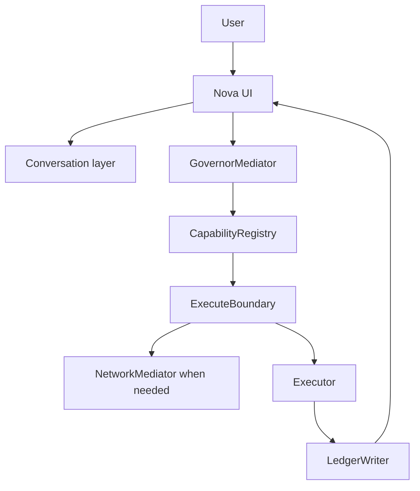

# NovaLIS

NovaLIS is a governed local AI system that separates intelligence from execution.

It is built for people who want a useful assistant without surrendering visibility or control. Nova can reason, summarize, operate bounded local actions, draft messages, and run governed operator workflows, but real actions pass through explicit capability gates, policy checks, and audit logging.

> Intelligence may expand. Authority may not expand without an explicit unlock.

For the authoritative runtime truth, active capability count, enabled phases, and generated fingerprint, see [docs/current_runtime/CURRENT_RUNTIME_STATE.md](docs/current_runtime/CURRENT_RUNTIME_STATE.md).

---

## Why It Exists

Most AI assistants blend conversation, tool use, and execution into one opaque surface. NovaLIS treats those as separate responsibilities:

- conversation can explain, plan, and present
- capabilities define what the system is allowed to do
- governance checks whether an action is permitted
- the ledger records what happened and why
- the user keeps final authority over sensitive actions

That makes Nova less flashy in the wrong places and more trustworthy where it matters.

---

## What Nova Can Do Today


### Research and Information

| Task | Example |
| --- | --- |
| Search the web | `search for local AI tools` |
| Get news | `news`, `headlines`, `daily brief` |
| Summarize stories | `summarize headline 2`, `more on story 1` |
| Build reports | `intelligence brief`, `research battery technology` |
| Track stories | `track story EU AI Act` |
| Weather and calendar snapshots | `weather`, `calendar`, `today's schedule` |
| Verify or review an answer | `verify this`, `second opinion` |

### Local Control

| Task | Example |
| --- | --- |
| Open a website | `open github` |
| Open a file or folder | `open downloads` |
| Control volume | `volume up`, `mute`, `set volume to 50` |
| Control brightness | `brightness down`, `set brightness to 65` |
| Control media playback | `play`, `pause`, `resume` |
| Check system state | `system status`, `system check` |
| Read text aloud | `read that out loud`, `speak that` |

### Governed Workflows

| Task | What happens |
| --- | --- |
| Email drafting | Nova writes a draft and opens your mail client; you review and send manually. |
| Screen explanation | Nova analyzes an explicit screenshot or screen request; no background capture loop is created. |
| Memory governance | You can save, search, edit, export, lock, defer, and delete governed memory. |
| OpenClaw runs | Agent-style workflows run through bounded templates, state tracking, delivery controls, and runtime limits. |
| Connector reports | Connector-backed intelligence reports remain governed and read-only unless explicitly unlocked. |

---

## Why It Is Different

- **Governance-first:** every real action flows through the capability and policy spine.
- **Local-first:** core use is designed around local runtime and user-controlled state.
- **Auditable:** governed actions are written to an append-only local ledger.
- **Bounded:** capabilities are registered, enabled, tested, and inspectable.
- **Honest about runtime state:** generated docs describe what is actually active.
- **Built for operators:** Nova emphasizes repeatable workflows, status visibility, and failure awareness.

---

## Quick Start

See [QUICKSTART.md](QUICKSTART.md) for the full first-run path.

Short version for a development checkout:

```bash
git clone https://github.com/christopherbdaugherty96/NovaLIS.git
cd NovaLIS
pip install -e .
nova-start
```

Then open `http://localhost:8000` and try:

- `system status`
- `daily brief`
- `open downloads`
- `draft an email to test@example.com about the weekly update`

---

## How The Governance Spine Works



The conversation path can explain and present. The governed capability path is the only path that can execute real actions.

---

## Documentation

Start here:

- [Docs index](docs/INDEX.md)
- [Quickstart](QUICKSTART.md)
- [Use cases](USE_CASES.md)
- [Visual proof](docs/product/visual_proof.md)
- [Runtime state](docs/current_runtime/CURRENT_RUNTIME_STATE.md)
- [Architecture](docs/reference/ARCHITECTURE.md)
- [Human guides](docs/reference/HUMAN_GUIDES/)
- [Repo improvement action plan](docs/future/repo_improvement_action_plan.md)

For roadmap details, see [4-15-26 NEW ROADMAP/Now.md](4-15-26%20NEW%20ROADMAP/Now.md) and [4-15-26 NEW ROADMAP/MasterRoadMap.md](4-15-26%20NEW%20ROADMAP/MasterRoadMap.md).

---

## Project Status

Nova is early software with a serious governance model. It is actively evolving across runtime reliability, routing quality, memory governance, operator workflows, connector support, and public documentation.

Use generated runtime docs rather than README claims when you need exact current counts, enabled capability IDs, or fingerprint hashes.

---

## License

Nova is source-available, not open-source.

The code is visible so you can read it, understand it, audit the governance spine, and contribute, but it is not freely available for commercial reuse, redistribution, or building a competing product.

Nova is released under the [Business Source License 1.1](LICENSE). Under this license:

- you can read the code, run it locally for personal use, and contribute via pull requests
- you can inspect the governance and safety model
- you cannot use this code to build or operate a competing commercial product or service
- you cannot redistribute or sublicense it without permission

On 2030-04-18 the license converts automatically to Apache 2.0.
