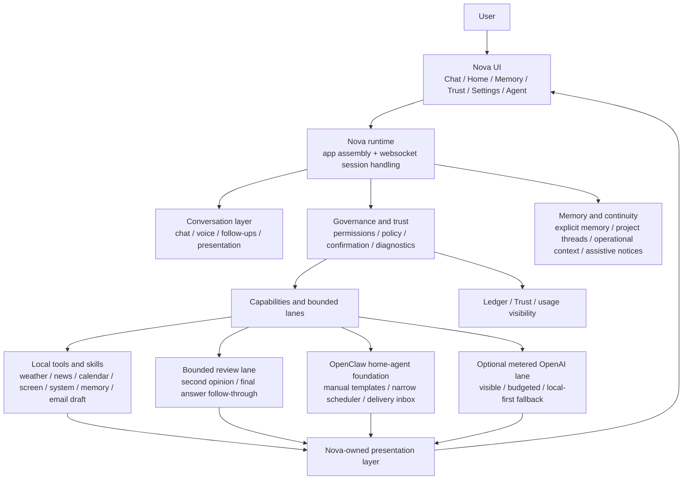

# Nova — Your Local Intelligence System

Nova is a **private, offline-capable AI assistant that runs entirely on your own computer.**
No cloud, no data harvesting, no background processes you didn't ask for.

Every action Nova takes passes through a single auditable authority spine — and every action
is logged to a local, append-only ledger so you can always see what it did and why.

---

## What Nova can do today

| Capability | How to ask |
|---|---|
| Chat with a local LLM | Just type naturally |
| Web search (optional) | "search for X" |
| News, weather, calendar snapshots | "weather", "tell me the news", "my schedule today" |
| Email draft (opens in your mail client) | "draft an email to john@example.com about the project" |
| Screen capture + explain | "take a screenshot", "explain this screen" |
| Memory you control | "remember this: …", "what do you remember?" |
| Track news stories over time | "track story AI regulation" |
| Second-opinion review | "second opinion on this answer" |
| Volume, brightness, media controls | "volume up", "set brightness to 60" |
| Open files, folders, websites | "open my downloads folder", "open github" |
| Read text aloud (local TTS) | "read that out loud" |
| System diagnostics | "system check" |

Nova currently ships **26 active capabilities** — all governed, all logged.

---

## How it works

Nova's core design rule is simple:

> **Intelligence may expand. Authority may not expand without an explicit unlock.**

Every real action — anything that touches your machine or the network — flows through a five-component governance spine before it executes:



The **conversation path never acts** — it only explains and presents.
Only the **governed capability path** can execute a real action, and only after passing through:

1. **GovernorMediator** — recognises the intent and checks policy
2. **CapabilityRegistry** — ensures the intent maps to a registered, enabled capability
3. **ExecuteBoundary** — enforces resource limits, confirmation state, and argument shape
4. **NetworkMediator** — gates any outbound network call by policy
5. **LedgerWriter** — appends an immutable event to the local audit log

There is no back door.

---

## Quick start

> **Prerequisites:** [Python 3.10+](https://python.org) and [Ollama](https://ollama.com) installed.

```bash
# 1. Pull a model
ollama pull gemma4:e4b

# 2. Clone
git clone https://github.com/YOUR_USERNAME/Nova-Project.git
cd Nova-Project

# 3. Install
pip install -e .

# 4. Run
nova-start

# 5. Open your browser
#    → http://localhost:8000
```

A one-click **Windows installer** is in progress (see [installer/README.md](installer/README.md)).

---

## Learn more

### For everyone
| Document | What it covers |
|---|---|
| [Introduction](docs/INTRODUCTION.md) | What Nova is, why it exists, the privacy model — written for non-engineers |
| [Human Guides →](docs/reference/HUMAN_GUIDES/) | 32 plain-language guides: how Nova works, what it can do, command examples, daily workflows, FAQ, glossary, and more |
| [What Nova can do (guide 03)](docs/reference/HUMAN_GUIDES/03_WHAT_NOVA_CAN_DO.md) | Full capability list with usage examples |
| [Safety and Trust (guide 06)](docs/reference/HUMAN_GUIDES/06_SAFETY_AND_TRUST.md) | How governance, memory, and the ledger protect you |
| [Visual Architecture Map (guide 21)](docs/reference/HUMAN_GUIDES/21_VISUAL_ARCHITECTURE_MAP.md) | The diagram above + plain-language explanation of every layer |

### For developers
| Document | What it covers |
|---|---|
| [Architecture](docs/ARCHITECTURE.md) | Governance spine, capability inventory, ledger, drift-check tooling |
| [MasterRoadMap](4-15-26%20NEW%20ROADMAP/MasterRoadMap.md) | Full multi-tier plan |
| [Now.md](4-15-26%20NEW%20ROADMAP/Now.md) | Current sprint — what's active right now |
| [CHANGELOG](4-15-26%20NEW%20ROADMAP/CHANGELOG.md) | Rolling log of shipped work |

---

## Why Nova

- **Your data stays yours** — everything runs on your machine; nothing leaves unless you ask it to
- **Works without internet** — core chat and device controls need no network
- **Every action is auditable** — the append-only ledger records what happened and why
- **You stay in control** — Nova drafts emails; you send them. Nova reads screen; you decide what to do next.

---

## Roadmap highlights (next)

- macOS installer / `.app` bundle
- Calendar write (with explicit confirmation)
- Backup and uninstaller
- Refactor of the two large runtime files (`brain_server.py`, `session_handler.py`)

See [`MasterRoadMap.md`](4-15-26%20NEW%20ROADMAP/MasterRoadMap.md) for the full multi-tier plan.

---

*Nova is early software. It is honest about what it can and cannot do, and it is built for people who want real control over their own assistant.*
