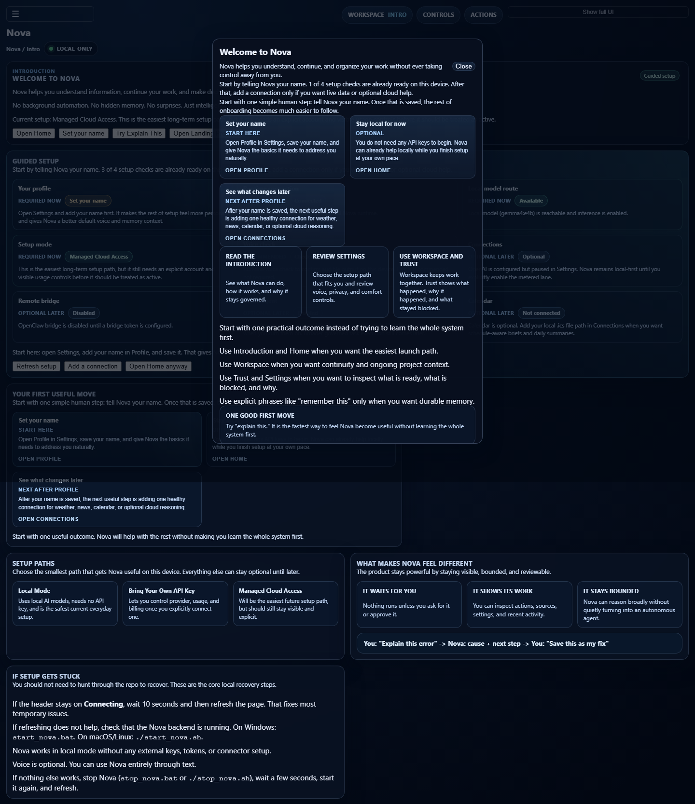
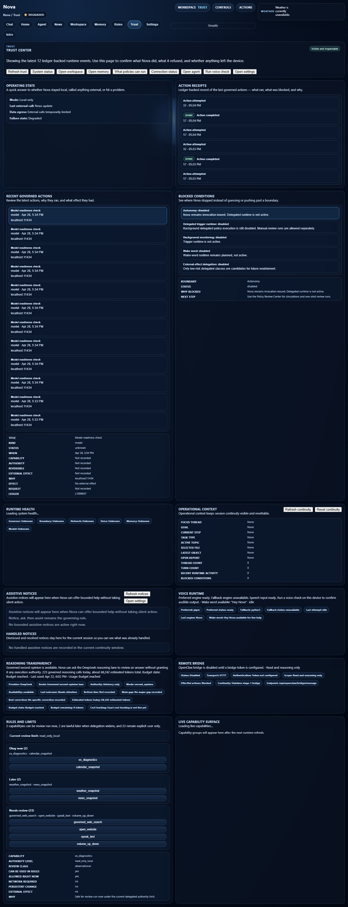
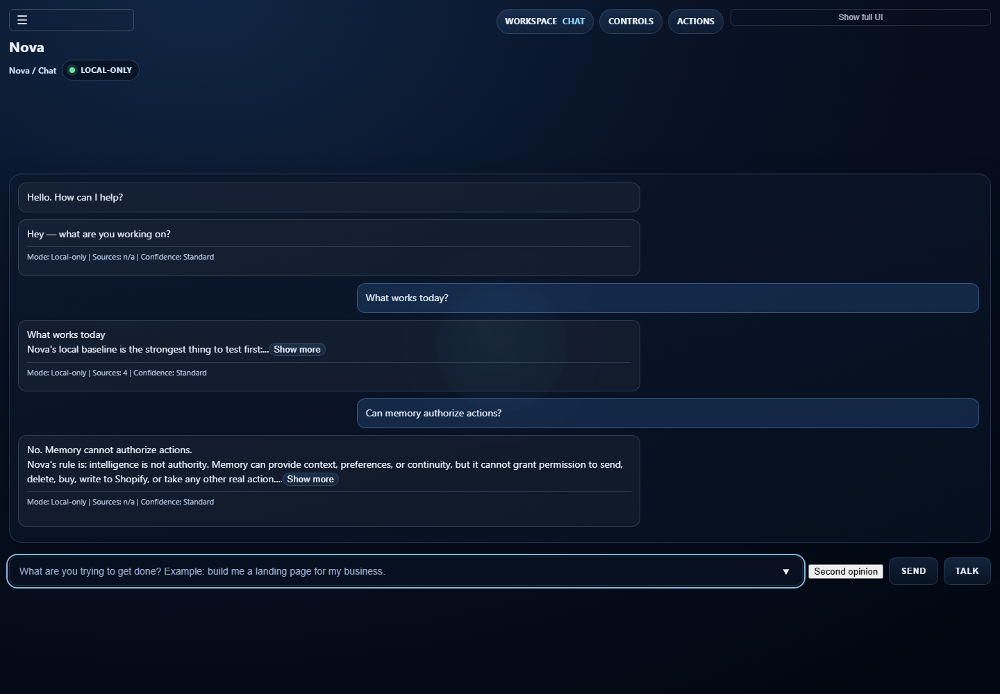

# NovaLIS

**Version 0.4 Alpha**

NovaLIS is a governance-first local AI system designed to separate intelligence from execution.

Nova focuses on what the system is allowed to do, how actions are routed, and how real execution stays visible, bounded, and reviewable.

## Why Nova
Most AI tools optimize for capability expansion. Nova emphasizes bounded execution, reviewable actions, local ownership, and user-visible control.

## Start Here
1. [Start Here](START_HERE.md)
2. [Quickstart](QUICKSTART.md)
3. [First 5 Minutes](docs/product/FIRST_5_MINUTES.md)
4. [What Works Today](docs/product/WHAT_WORKS_TODAY.md)
5. [Nova Operating Model](docs/product/NOVA_OPERATING_MODEL.md)
6. [Nova Brain](docs/brain.md)
7. [Brain Architecture Package](docs/brain/README.md)
8. [Conversation and Memory Model](docs/product/CONVERSATION_AND_MEMORY_MODEL.md)
9. [Known Limitations](docs/product/KNOWN_LIMITATIONS.md)
10. [Current Runtime State](docs/current_runtime/CURRENT_RUNTIME_STATE.md)
11. [Current Work Status](docs/status/CURRENT_WORK_STATUS.md)

## Proof Layer
- [Trust Proof Plan](docs/product/TRUST_PROOF_PLAN.md)
- [Trust Review Card Plan](docs/product/TRUST_REVIEW_CARD_PLAN.md)
- [See It Work](docs/product/SEE_IT_WORK.md)
- [Trust Model](docs/product/TRUST_MODEL.md)
- [Demo Script](docs/product/DEMO_SCRIPT.md)
- [Screenshot Asset Plan](docs/product/SCREENSHOT_ASSET_PLAN.md)
- [Trust UI Spec](docs/product/TRUST_UI_SPEC.md)
- [Capability Verification Status](docs/capability_verification/STATUS.md)
- [Capability Signoff Matrix](docs/product/CAPABILITY_SIGNOFF_MATRIX.md)
- [Proof Capture Checklist](docs/product/PROOF_CAPTURE_CHECKLIST.md)

## Current Demo Proof
Latest proof package:

- [2026-04-29 Conversation + Search Proof](docs/demo_proof/2026-04-29_conversation_search_proof/CONVERSATION_SEARCH_REPORT.md)
- [Conversation + Search Proof Index](docs/demo_proof/2026-04-29_conversation_search_proof/PROOF_INDEX.md)
- [Brain Live Test Report](docs/demo_proof/brain_live_test/REPORT.md)
- [Brain Live Test Proof Index](docs/demo_proof/brain_live_test/PROOF_INDEX.md)
- [2026-04-28 User Test Report](docs/demo_proof/2026-04-28_user_test/USER_TEST_REPORT.md)
- [Proof Index](docs/demo_proof/2026-04-28_user_test/PROOF_INDEX.md)
- [Demo Script](docs/demo_proof/2026-04-28_user_test/DEMO_SCRIPT.md)
- [Friction Log](docs/demo_proof/2026-04-28_user_test/FRICTION_LOG.md)
- [Screenshot Checklist](docs/demo_proof/2026-04-28_user_test/SCREENSHOT_CHECKLIST.md)
- [Recorded Demo Flow](docs/demo_proof/2026-04-28_user_test/video/nova_user_test_demo_flow.webm)

Recent local-first proof captures:

Current proof verdict: the local demo path mostly works. The Brain Task Clarifier now handles tested ambiguity/boundary prompts, while the active sprint remains Cap 16 web-search answer quality and conversation coherence. Remaining friction is concentrated around CPU-budget handling for current searches, follow-up coherence, and clearer uncertainty behavior.

## Current Status
Alpha build for technical users and early adopters. Real project under active development, not a finished consumer product.

For exact generated runtime truth, use [Current Runtime State](docs/current_runtime/CURRENT_RUNTIME_STATE.md).

For current human-readable work continuity, including what is committed versus local/in-progress, use [Current Work Status](docs/status/CURRENT_WORK_STATUS.md).

For the 2026-05-01 branch/workstream alignment map, use [Repo Branch and Workstream Status](docs/status/REPO_BRANCH_AND_WORKSTREAM_STATUS_2026-05-01.md).

## Future Directions
- [Realistic Scope and Priorities](docs/future/REALISTIC_SCOPE_AND_PRIORITIES.md)
- [Google Connector Model](docs/future/NOVA_GOOGLE_CONNECTOR_MODEL.md)
- [Google Connector Implementation Roadmap](docs/future/GOOGLE_CONNECTOR_IMPLEMENTATION_ROADMAP.md)
- [Free-First Cost Governance First Steps](docs/design/Phase%206/FREE_FIRST_COST_GOVERNANCE_FIRST_STEPS_2026-04-30.md)
- [Governed Media and E-Commerce Engine](docs/future/NOVA_GOVERNED_MEDIA_AND_ECOMMERCE_ENGINE.md)
- [Media Engine Safe Implementation Roadmap](docs/future/NOVA_MEDIA_ENGINE_SAFE_IMPLEMENTATION_ROADMAP.md)
- [Nova x Auralis Digital Website Engine](docs/future/NOVA_AURALIS_DIGITAL_WEBSITE_ENGINE.md)
- [Auralis Website Coworker Workflow](docs/future/AURALIS_WEBSITE_COWORKER_WORKFLOW.md)
- [YouTubeLIS Tool Folder](docs/tools/youtubelis.md)

## Core Principle
**Intelligence is not authority.**

Nova may reason, summarize, search, draft, and recommend. Conversation context and memory can improve understanding, but they do not authorize execution. Real actions should remain bounded by capability checks, execution boundaries, confirmation where required, and visible receipts.

## AI Workflow Note
This project may use AI tools for planning, coding support, audits, review, and prototyping.

- GitHub remains the durable source of truth for code, docs, commits, and project status.
- Runtime truth should be grounded in implementation, tests, and generated runtime artifacts.
- Visual builders or prototype tools may help present ideas, but do not replace Nova's governed runtime.
- AI-generated work should be reviewed before being treated as final.

See:
- [AI Tooling Workflow](docs/WORKFLOW_AI_TOOLING.md)
- [AI Tooling Boundaries](docs/AI_TOOLING_BOUNDARIES.md)

## License
See [LICENSE].
