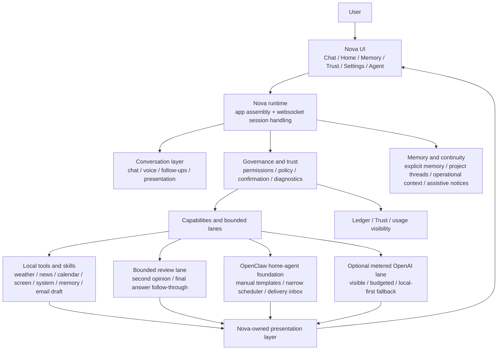

# Nova — Your Local Intelligence System

Nova is a **private, offline-capable AI assistant that runs entirely on your own computer.**
No cloud, no data harvesting, no background processes you didn't ask for.

Every action Nova takes passes through a single auditable authority spine — and every action
is logged to a local, append-only ledger so you can always see what it did and why.

---

## Current phase — Tier 2 (April 2026)

| Tier | Goal | Status |
|---|---|---|
| **Tier 1** — Try-ability | One-click installer + simplified UI + CI | ✅ Done |
| **Tier 2** — First real-world action | Email draft end-to-end (cap 64) | ✅ Done — awaiting live sign-off |
| **Tier 2.5** — Reliability & ownership | Backup, restore, uninstaller, offline mode | Next |
| **Tier 3** — Long-term health | Refactor hot-path files, remove frontend duplication | Planned |
| **Tier 4** — Ecosystem | Distribution, support, security lifecycle, beta program | Planned |

**What just shipped (Tier 2.1):** Email draft — Nova composes an email body, opens it in your mail client, and waits for you to send. Nova never sends on your behalf.

**What's next:** Live sign-off and lock of cap 64 → then Tier 2.5 reliability work (backup, uninstaller, offline awareness).

---

## What Nova can do today

### Research and information
| What | How to ask |
|---|---|
| Search the web | `search for local AI tools` |
| Today's news | `news`, `headlines`, `daily brief` |
| Deep news summaries | `summarize headline 2`, `more on story 1` |
| Multi-source report | `intelligence brief` |
| Track a story over time | `track story EU AI Act` |
| Weather | `weather`, `forecast` |
| Calendar snapshot | `calendar`, `today's schedule` |
| Second opinion on an answer | `second opinion` |
| Verify a statement | `verify this` |

### Computer and local control
| What | How to ask |
|---|---|
| Open a website | `open github` |
| Open a file or folder | `open downloads` |
| Volume | `volume up`, `mute`, `set volume to 50` |
| Brightness | `brightness down`, `set brightness to 65` |
| Media playback | `pause`, `next track` |
| System status | `system status`, `system check` |
| Read text aloud | `read that out loud`, `speak that` |

### Email drafting *(first external write — cap 64)*
| What | How to ask |
|---|---|
| Draft an email | `draft an email to john@example.com about the quarterly review` |
| Compose with subject | `compose an email to the team about Friday's meeting` |
| Quick email | `email alex@example.com about the deployment schedule` |

Nova opens the draft in your mail client. You review and decide whether to send.
A confirmation prompt appears before anything opens.

### Screen and explain
| What | How to ask |
|---|---|
| Take a screenshot | `take a screenshot` |
| Explain what's on screen | `explain this screen`, `what am I looking at?` |
| Analyze a region | `analyze this screen` |

### Memory and continuity
| What | How to ask |
|---|---|
| Save something | `remember this: client prefers morning calls` |
| Review memory | `what do you remember`, `memory overview` |
| Search memory | `search memories for deployment` |
| Forget something | `forget this` |
| Project threads | `create thread deployment issue`, `continue my project` |
| Workspace board | `workspace board` |

### Trust and visibility
| What | How to ask |
|---|---|
| See recent actions | `trust center` |
| See what's blocked | `trust status` |
| Review policies | `policy center` |
| Voice status | `voice status` |

Nova currently ships **26 active capabilities** — all governed, all logged.

---

## How it works

Nova's core design rule:

> **Intelligence may expand. Authority may not expand without an explicit unlock.**

Every real action flows through a five-component governance spine before it executes:



The **conversation path never acts** — it only explains and presents.
Only the **governed capability path** can execute a real action, and only after passing through:

1. **GovernorMediator** — recognises the intent and checks policy
2. **CapabilityRegistry** — ensures the intent maps to a registered, enabled capability
3. **ExecuteBoundary** — enforces resource limits, confirmation state, and argument shape
4. **NetworkMediator** — gates any outbound network call by policy
5. **LedgerWriter** — appends an immutable event to the local audit log

There is no back door.

---

## Quick start

> **Prerequisites:** [Python 3.10+](https://python.org) and [Ollama](https://ollama.com) installed.

```bash
# 1. Pull a model
ollama pull gemma4:e4b

# 2. Clone
git clone https://github.com/YOUR_USERNAME/Nova-Project.git
cd Nova-Project

# 3. Install
pip install -e .

# 4. Run
nova-start

# 5. Open your browser at http://localhost:8000
```

A **Windows installer** (`NovaSetup-0.1.0.exe`) is available in [GitHub Releases](../../releases).
macOS package is planned for Tier 2.5.

---

## What's planned

### Next — Tier 2.5 (Reliability & Ownership)
- Backup and restore (full system state)
- Uninstaller
- Offline capability awareness
- Log export (sanitised)
- Resource limits (CPU, memory, time)
- Privacy modes and transparency dashboard

### Later — Tier 3 (Long-term health)
- Refactor the two large runtime files (`brain_server.py`, `session_handler.py`)
- Remove frontend duplication
- Reduce docs sprawl

### Later — Tier 4 (Ecosystem)
- Distribution channel (GitHub Releases + landing page)
- User support model (issue templates, in-app report)
- Security maintenance policy
- Storage lifecycle policy
- Beta program and success metrics
- macOS `.app` bundle

See [`MasterRoadMap.md`](4-15-26%20NEW%20ROADMAP/MasterRoadMap.md) for the full tiered plan with acceptance criteria.

---

## Learn more

### For everyone
| Document | What it covers |
|---|---|
| [Introduction](docs/INTRODUCTION.md) | What Nova is, why it exists, the privacy model |
| [Human Guides →](docs/reference/HUMAN_GUIDES/) | 33 plain-language guides covering everything |
| [What Nova can do (guide 03)](docs/reference/HUMAN_GUIDES/03_WHAT_NOVA_CAN_DO.md) | Full capability list with examples |
| [Command examples (guide 08)](docs/reference/HUMAN_GUIDES/08_COMMAND_EXAMPLES.md) | Natural phrases that work |
| [Safety and Trust (guide 06)](docs/reference/HUMAN_GUIDES/06_SAFETY_AND_TRUST.md) | Governance, memory, and the ledger |

### For developers
| Document | What it covers |
|---|---|
| [Architecture](docs/ARCHITECTURE.md) | Governance spine, capability inventory, ledger, drift-check tooling |
| [Capability Verification (guide 33)](docs/reference/HUMAN_GUIDES/33_CAPABILITY_VERIFICATION_GUIDE.md) | 6-phase verification system, lock mechanism, regression guard |
| [MasterRoadMap](4-15-26%20NEW%20ROADMAP/MasterRoadMap.md) | Full multi-tier plan with acceptance criteria |
| [Now.md](4-15-26%20NEW%20ROADMAP/Now.md) | Current sprint — what's active right now |
| [CHANGELOG](4-15-26%20NEW%20ROADMAP/CHANGELOG.md) | Rolling log of shipped work |

---

## Why Nova

- **Your data stays yours** — everything runs on your machine; nothing leaves unless you ask
- **Works without internet** — core chat and device controls need no network
- **Every action is auditable** — the append-only ledger records what happened and why
- **You stay in control** — Nova drafts emails; you send them. Nova reads your screen; you decide what to do next.

---

## License

Nova is **source-available**, not open-source.

The code is visible so you can read it, understand it, audit the governance spine, and contribute — but it is not freely available for commercial reuse, redistribution, or building a competing product.

Nova is released under the [Business Source License 1.1 (BUSL-1.1)](LICENSE). Under this license:

- **You can** read the code, run it locally for personal use, and contribute via pull requests
- **You can** inspect the governance and safety model — transparency is part of the design
- **You cannot** use this code to build or operate a competing commercial product or service
- **You cannot** redistribute or sublicense it without permission

On **2030-04-18** the license converts automatically to [Apache 2.0](https://www.apache.org/licenses/LICENSE-2.0) — fully open at that point.

This is a deliberate choice. It lets Nova be transparent and open to collaboration without giving up the ability to build something sustainable. If you are interested in a commercial arrangement before that date, reach out directly.

---

*Nova is early software. It is honest about what it can and cannot do, and it is built for people who want real control over their own assistant.*
