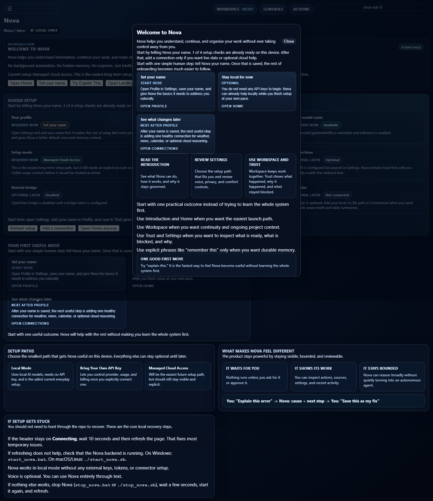
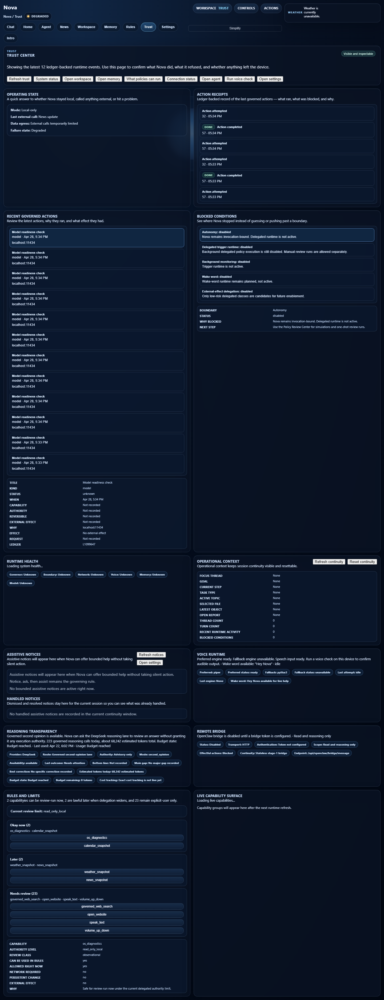
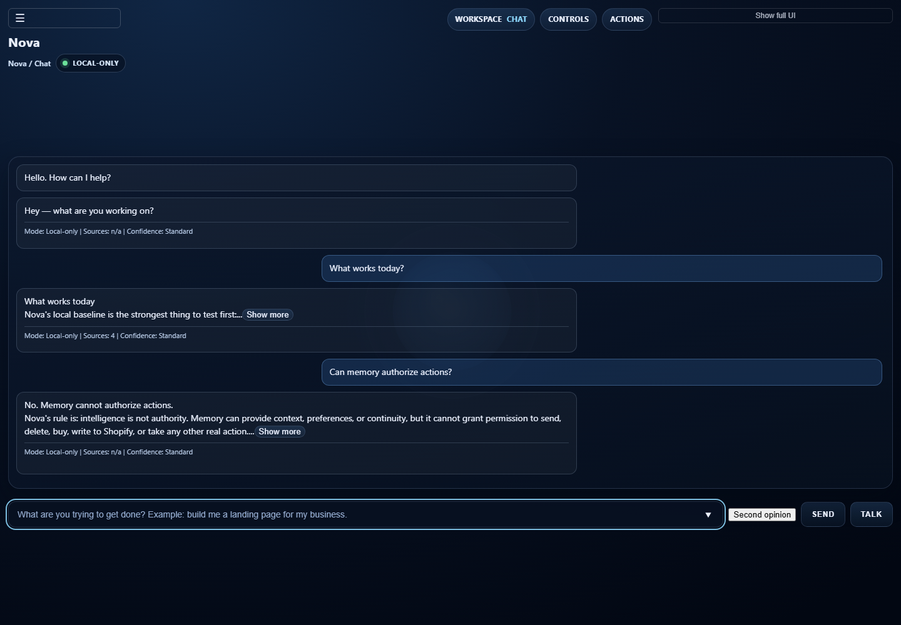

# NovaLIS

**Version 0.5 Alpha — Current State**

> **Nova is a local-first, governed awareness and decision-support system that maintains
> context, identifies what matters, reduces uncertainty, and coordinates authorized tools only
> when evidence and authority justify action.**

Nova separates intelligence from authority so useful reasoning can remain broad while real
execution stays bounded, inspectable, revocable, and provable.

## Why Nova
Most assistants wait for a command. Nova is being built to establish what changed, what matters,
what remains uncertain, and which decision deserves attention before choosing whether a tool is
relevant.

Its permanent architectural model is:

```text
Awareness -> Decision -> Authority -> Execution -> Outcome
```

Capability is a property of the governed runtime: what Nova can technically do. It is not
permission. Authority decides whether an exact action may occur. In Nova’s target architecture,
Outcome is responsible for verifying what actually happened and reconciling it into future
awareness without expanding permission.

The intended operating loop is:

```text
Observe -> build awareness -> identify relevance -> expose uncertainty -> recommend
-> authorize -> execute -> evaluate outcome -> reconcile -> record
```

Intelligence proposes. Nova governs. You decide.

Canonical ordering authority for all future work:
- [Nova Master Roadmap 2026-07-05](docs/future/NOVA_MASTER_ROADMAP_2026-07-05.md)

Canonical future-product summary:
- [Nova Authority and Decision OS Direction](docs/future/NOVA_AUTHORITY_AND_DECISION_OS_DIRECTION_2026-07-28.md)

See:
- [Product Definition](docs/product/PRODUCT_DEFINITION.md)
- [Nova Two-Domain Direction](docs/future/NOVA_TWO_DOMAIN_DIRECTION_2026-05-11.md)
- [Nova Creator-Led Shopify POD Model](docs/future/NOVA_CREATOR_LED_SHOPIFY_POD_MODEL_2026-05-11.md)
- [Five-Pass Stability And Operational Roadmap](docs/status/FIVE_PASS_STABILITY_AND_OPERATIONAL_ROADMAP_2026-05-12.md)
- [Repo Sync And Roadmap Update](docs/status/REPO_SYNC_AND_ROADMAP_UPDATE_2026-05-12.md)

## Start Here

Current truth first (recommended reading order):

1. [Canonical Truth Index](docs/CANONICAL/00_INDEX.md) — how to read repo truth
2. [Daily Command Center](docs/status/DAILY_COMMAND_CENTER.md) — where the project is right now
3. [Capability Inventory](docs/capability_verification/CAPABILITY_INVENTORY.md) — what verifiably works
4. [Product Definition](docs/product/PRODUCT_DEFINITION.md) — identity, mission, phases
5. [Current Runtime State](docs/current_runtime/CURRENT_RUNTIME_STATE.md) — generated runtime truth

For runtime-existence claims, generated runtime docs win; CANONICAL explains how to resolve conflicts.

Then the human onboarding path:

6. [Start Here](START_HERE.md)
7. [Quickstart](QUICKSTART.md)
8. [First 5 Minutes](docs/product/FIRST_5_MINUTES.md)
9. [What Works Today](docs/product/WHAT_WORKS_TODAY.md)
10. [Nova Operating Model](docs/product/NOVA_OPERATING_MODEL.md)
11. [Nova Brain](docs/brain.md)
12. [Conversation and Memory Model](docs/product/CONVERSATION_AND_MEMORY_MODEL.md)
13. [Known Limitations](docs/product/KNOWN_LIMITATIONS.md)
14. [Current Work Status](docs/status/CURRENT_WORK_STATUS.md)

## Proof Layer
- [Trust Proof Plan](docs/product/TRUST_PROOF_PLAN.md)
- [Trust Review Card Plan](docs/product/TRUST_REVIEW_CARD_PLAN.md)
- [See It Work](docs/product/SEE_IT_WORK.md)
- [Trust Model](docs/product/TRUST_MODEL.md)
- [Demo Script](docs/product/DEMO_SCRIPT.md)
- [Screenshot Asset Plan](docs/product/SCREENSHOT_ASSET_PLAN.md)
- [Trust UI Spec](docs/product/TRUST_UI_SPEC.md)
- [Capability Verification Status](docs/capability_verification/STATUS.md)
- [Capability Signoff Matrix](docs/product/CAPABILITY_SIGNOFF_MATRIX.md)
- [Proof Capture Checklist](docs/product/PROOF_CAPTURE_CHECKLIST.md)

## Selected Proof Packages
Selected historical and current proof records:

- [Seven-Morning Synthesis — 2026-07-22](docs/observation/SEVEN_MORNING_SYNTHESIS_2026-07-22.md)
- [Grounded Brief Routing Closeout — 2026-07-23](docs/status/GROUNDED_BRIEF_ROUTING_CLOSEOUT_2026-07-23.md)
- [Current Capability Inventory](docs/capability_verification/CAPABILITY_INVENTORY.md)

- [2026-04-29 Conversation + Search Proof](docs/demo_proof/2026-04-29_conversation_search_proof/CONVERSATION_SEARCH_REPORT.md)
- [Conversation + Search Proof Index](docs/demo_proof/2026-04-29_conversation_search_proof/PROOF_INDEX.md)
- [Brain Live Test Report](docs/demo_proof/brain_live_test/REPORT.md)
- [Brain Live Test Proof Index](docs/demo_proof/brain_live_test/PROOF_INDEX.md)
- [2026-04-28 User Test Report](docs/demo_proof/2026-04-28_user_test/USER_TEST_REPORT.md)
- [Proof Index](docs/demo_proof/2026-04-28_user_test/PROOF_INDEX.md)
- [Demo Script](docs/demo_proof/2026-04-28_user_test/DEMO_SCRIPT.md)
- [Friction Log](docs/demo_proof/2026-04-28_user_test/FRICTION_LOG.md)
- [Screenshot Checklist](docs/demo_proof/2026-04-28_user_test/SCREENSHOT_CHECKLIST.md)
- [Recorded Demo Flow](docs/demo_proof/2026-04-28_user_test/video/nova_user_test_demo_flow.webm)
- [Live User Simulation Results — 2026-05-19](docs/audits/LIVE_USER_SIMULATION_RESULTS_2026-05-19.md)

Recent local-first proof captures:







Current proof verdict:

```text
Governance paths are now strongly evidenced for the current confirmation-bound scope.
Everyday live-session reliability workstream closed 2026-05-19 (75% -> 97% pass, 0 timeouts).
Seven-morning observation and its rank-1 grounded-routing repair are complete.
Later current-state and acceptance-provenance details live in the Daily Command Center.
Nova is not yet a finished consumer product.
```

## Current Status
Version 0.5 Alpha is a technical-user / early-adopter state, not a finished mainstream release.

Current grounded status:

```text
- local-first governed awareness and decision-support system
- bounded execution infrastructure exists
- generated runtime state reports 27 active capability surfaces
- active != certified != locked != configured != authorized
- Cap 16 web search is P1-P5 certification-locked
- Cap 22 file-folder access is P1-P5 certification-locked
- Cap 64 email draft is P1-P5 certification-locked and remains local mailto draft only
- Cap 65 Shopify intelligence is P1-P5 certification-locked, read-only, not Shopify writes
- OpenClaw exists as bounded/manual-first runtime infrastructure; presence does not imply broad autonomy
- Wave A1, A2, B1, B2, B3, B4, and Wave C stabilization are complete and merged
- immutable Wave C validated_baseline_sha:
  ec20a7146f7d6d55b8983cb7d6d3918d5fad9915
- GitHub-hosted Wave C jobs remained NOT EXECUTED because of the external account/billing
  restriction tracked in Issue #354; the owner waived that source as mandatory exit evidence
  without classifying it as PASS
- post-Wave-C documentation closeout is the current gate; this README is one reviewed
  front-door follow-up and does not by itself complete or authorize the closeout
- PR #335 Google Workspace Foundation remains draft/unmerged historical Foundation/auth/identity code;
  it is not a current capability and must be reconstructed/reviewed separately before any merge
- Google Tasks and Gmail are not built as current Nova capabilities
- Operational Continuity is strategically accepted but implementation-inactive and non-authorizing
- no broad browser/computer-use, financial-write, autonomous outreach, contracting,
  autonomous-business, broad provider-routing, or expanded OpenClaw authority lane is active
```

For exact generated runtime truth, use [Current Runtime State](docs/current_runtime/CURRENT_RUNTIME_STATE.md).

For current human-readable work continuity, including the current gate, use [Current Work Status](docs/status/CURRENT_WORK_STATUS.md).

Historical sequencing references (May 2026; superseded by the master roadmap for ordering):
[Five-Pass Stability And Operational Roadmap](docs/status/FIVE_PASS_STABILITY_AND_OPERATIONAL_ROADMAP_2026-05-12.md),
[Repo Sync And Roadmap Update](docs/status/REPO_SYNC_AND_ROADMAP_UPDATE_2026-05-12.md).

Current remaining order:

```text
1. Complete the post-Wave-C documentation closeout through separately reviewed front-door,
   historical-guide, operating-model, and Brain narration changes or an equivalent consolidation.
2. After documentation closeout is reviewed and merged, separately authorize reconstruction of
   PR #335 onto the immutable Wave C validated baseline.
3. Harden the bounded Google Foundation lifecycle defects identified during review, then rerun
   exact-head verification and independent security/architecture review.
4. Make the #335 merge decision separately.
5. Prove Google identity-only connection live without treating OAuth scope as Nova authority.
6. Add Google Tasks READ as the first provider-backed Google evidence vertical and prove
   provenance/freshness/evidence boundaries.
7. Only then evaluate an evidence-based Operational Continuity implementation warrant.

This summary authorizes nothing. The Daily Command Center, canonical roadmap truth, Issue #343,
and lane-specific locks hold current ordering and implementation scope.
```

## Future Directions

Ordering authority: [Nova Master Roadmap 2026-07-05](docs/future/NOVA_MASTER_ROADMAP_2026-07-05.md).
The documents below remain design references; the master roadmap decides sequence.

- [Nova Personal/Home/Business Operating System Summary](docs/future/NOVA_PERSONAL_HOME_BUSINESS_OS_SUMMARY.md)
- [Nova Two-Domain Direction](docs/future/NOVA_TWO_DOMAIN_DIRECTION_2026-05-11.md)
- [Nova Creator-Led Shopify POD Model](docs/future/NOVA_CREATOR_LED_SHOPIFY_POD_MODEL_2026-05-11.md)
- [Five-Pass Stability And Operational Roadmap](docs/status/FIVE_PASS_STABILITY_AND_OPERATIONAL_ROADMAP_2026-05-12.md)
- [Repo Sync And Roadmap Update](docs/status/REPO_SYNC_AND_ROADMAP_UPDATE_2026-05-12.md)
- [Realistic Scope and Priorities](docs/future/REALISTIC_SCOPE_AND_PRIORITIES.md)
- [Google Connector Model](docs/future/NOVA_GOOGLE_CONNECTOR_MODEL.md)
- [Google Connector Implementation Roadmap](docs/future/GOOGLE_CONNECTOR_IMPLEMENTATION_ROADMAP.md)
- [Free-First Cost Governance First Steps](docs/design/Phase%206/FREE_FIRST_COST_GOVERNANCE_FIRST_STEPS_2026-04-30.md)
- [Governed Media and E-Commerce Engine](docs/future/NOVA_GOVERNED_MEDIA_AND_ECOMMERCE_ENGINE.md)
- [Media Engine Safe Implementation Roadmap](docs/future/NOVA_MEDIA_ENGINE_SAFE_IMPLEMENTATION_ROADMAP.md)
- [Nova x Auralis Digital Website Engine](docs/future/NOVA_AURALIS_DIGITAL_WEBSITE_ENGINE.md)
- [Auralis Website Coworker Workflow](docs/future/AURALIS_WEBSITE_COWORKER_WORKFLOW.md)
- [YouTubeLIS Tool Folder](docs/tools/youtubelis.md)

## Core Principles
**Intelligence is not authority.**

**Visibility is not authority.**

**Capability is not permission.**

**Outcome learning may improve recommendations, never authority.**

Nova may reason, summarize, search, draft, and recommend. Conversation context and memory can improve understanding, but they do not authorize execution. Real actions should remain bounded by capability checks, execution boundaries, confirmation where required, and visible receipts.

Visibility surfaces, dashboards, proofs, and status views do not grant execution authority. They exist to help the operator understand what is active, what is locked, what is pending, and what actually happened.

## AI Workflow Note
This project may use AI tools for planning, coding support, audits, review, and prototyping.

- GitHub remains the durable source of truth for code, docs, commits, and project status.
- Runtime truth should be grounded in implementation, tests, and generated runtime artifacts.
- Visual builders or prototype tools may help present ideas, but do not replace Nova's governed runtime.
- AI-generated work should be reviewed before being treated as final.

See:
- [AI Tooling Workflow](docs/WORKFLOW_AI_TOOLING.md)
- [AI Tooling Boundaries](docs/AI_TOOLING_BOUNDARIES.md)

## License
See [LICENSE].
