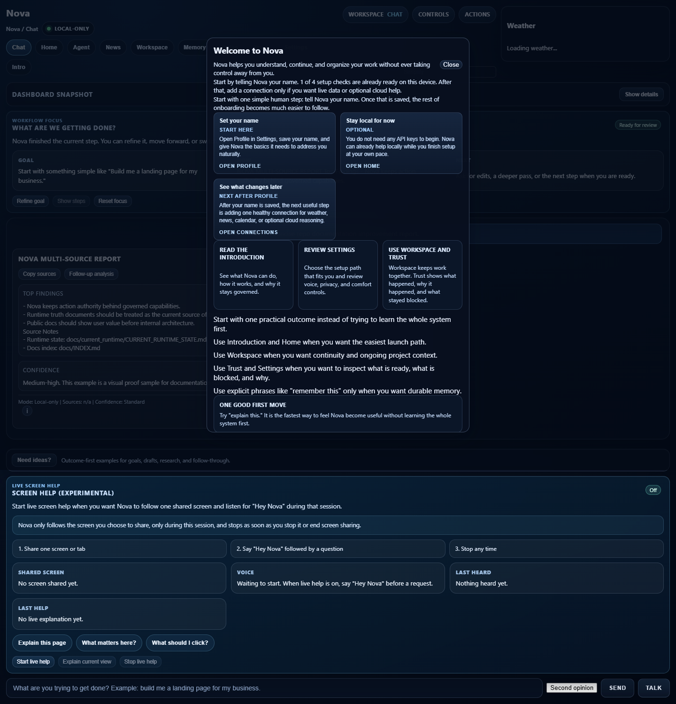
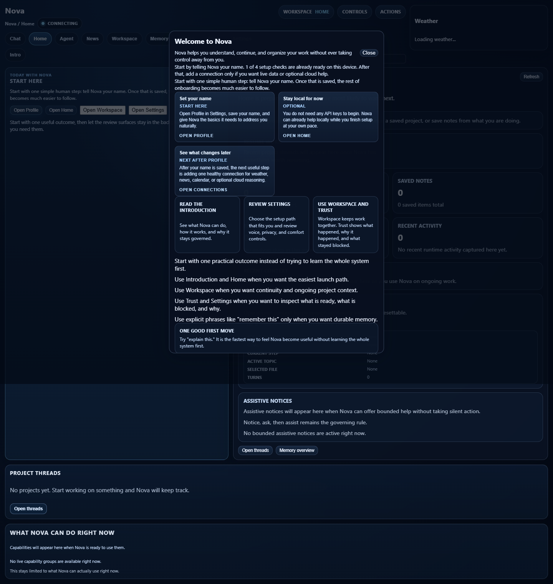

# NovaLIS Use Cases

NovaLIS is strongest when a task benefits from AI reasoning plus visible boundaries around action.

For screenshots of the dashboard, trust surface, and structured report output, see [docs/product/visual_proof.md](docs/product/visual_proof.md).

---

## 1. Daily Situation Brief

Ask:

```text
daily brief
```

Nova can gather current headlines, summarize key stories, and present follow-up actions such as expanding a story, comparing clusters, or tracking a topic.

Why Nova is useful here:

- summaries stay attached to governed sources and runtime surfaces
- follow-up actions remain bounded
- the system can track recurring topics over time

---

## 2. Research With Guardrails



Ask:

```text
research local AI tools for small businesses
```

Nova can produce structured research with findings, source context, and confidence notes.

Why Nova is useful here:

- web access goes through governed network paths
- larger reports use bounded reporting capabilities
- verification and second-opinion flows are available without execution authority

---

## 3. Local Desk Assistant



Ask:

```text
open downloads
mute
pause
system status
```

Nova can perform explicit local actions through registered capabilities.

Why Nova is useful here:

- local actions are mediated by the governance spine
- ambiguous commands trigger clarifications
- actions are visible to trust and runtime surfaces

---

## 4. Email Drafting Without Autonomous Sending

Ask:

```text
draft an email to alex@example.com about the deployment schedule
```

Nova can compose a draft and open it in the system mail client. The user reviews and sends manually.

Why Nova is useful here:

- it helps with writing
- it does not silently transmit
- the workflow remains confirmation-backed

---

## 5. Screen Explanation

Ask:

```text
take a screenshot
explain this screen
```

Nova can work with explicit screen captures to explain what is visible.

Why Nova is useful here:

- capture is request-time and explicit
- there is no hidden background capture loop
- screen explanation remains bounded and inspectable

---

## 6. Memory And Continuity

Ask:

```text
remember this: client prefers morning calls
memory overview
search memories for deployment
```

Nova can store governed memory, retrieve it, and help maintain project continuity.

Why Nova is useful here:

- memory has explicit management surfaces
- user-facing review and deletion are part of the model
- long-running projects can keep context without making every action autonomous

---

## 7. Operator And Connector Reports

Ask for connector-backed intelligence when configured, such as a store or operations report.

Why Nova is useful here:

- connector packages are governed
- read-only intelligence can be separated from write authority
- runtime state and policy controls make capability boundaries visible

---

## 8. Trial Loop And Quality Discovery

Nova includes a simulation-oriented trial loop for scripted scenarios. It helps expose routing misses, degraded provider behavior, unclear responses, unsafe requests, and long-conversation failures.

Why Nova is useful here:

- failures become structured gaps
- improvements can be measured over scenario runs
- operator capability grows through feedback instead of guesswork

See [docs/current_runtime/nova_trial_loop_roadmap.md](docs/current_runtime/nova_trial_loop_roadmap.md).
