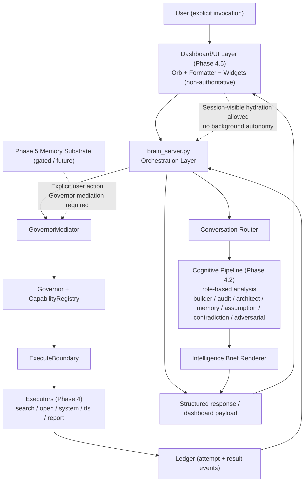

# NOVA Official Architecture Map

Status: Authoritative high-level runtime map  
Scope: Current Phase-4 runtime (with Phase-4.2 development surfaces present)

## Core Rules
- Intelligence does not equal authority.
- Only `brain_server` invokes `GovernorMediator`.
- Only Governor can authorize execution.
- Cognitive pipeline is analysis-only and non-authoritative.
- All network paths are mediated (`NetworkMediator` / `ModelNetworkMediator`).
- Boundary violations fail closed and are ledger-logged.
- UI hydration is session-visible only and non-background.

## Runtime Truth
- Canonical runtime file: `docs/current_runtime/CURRENT_RUNTIME_STATE.md`
- Phase-4 proof packet: `docs/PROOFS/Phase-4/PHASE_4_PROOF_PACKET_INDEX.md`
