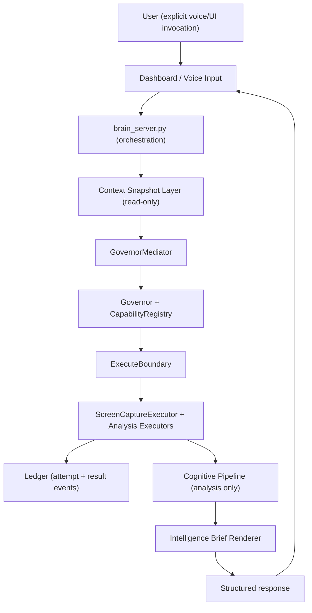

# NOVA Wake Word and Screen Context System

Document ID: NOVA-P45-PERCEPTION-2026.1  
Status: Design and Implementation Guide  
Scope: Invocation-bound screen understanding and context snapshots  
Authority Expansion: None  
Governor Supremacy: Maintained

## 1) Purpose

Nova should explain what the user is currently looking at without adding autonomy.

Target user commands:
- `Hey Nova, take a screenshot`
- `Hey Nova, what is this?`
- `Hey Nova, explain what I am looking at`
- `Hey Nova, analyze screen`

This feature adds perception, not authority:
- Explicitly invoked
- Governor mediated
- ExecuteBoundary constrained
- Ledger logged
- No background screen monitoring

## 2) Constitutional Constraints

The feature is valid only if all constraints below remain true.

1. Invocation-bound only:
   - Screen capture and context collection happen only after explicit user invocation (voice or UI action).
2. No continuous visual monitoring:
   - No polling loop, no passive screen watcher, no scheduled captures.
3. Read-only perception:
   - Context layer may read environment signals but cannot trigger execution actions.
4. Governor-only execution authority:
   - All capture/analysis capabilities route through `brain_server -> GovernorMediator -> Governor`.
5. Full transparency:
   - Every perception action produces ledger events.

## 3) Architecture Placement

Critical boundary:
- `Cognitive Pipeline` does not invoke the Governor directly.
- Only `brain_server` invokes `GovernorMediator`.

## 4) Wake Word Model

Recommended engines (local-only):
- Option A: `pvporcupine` (preferred reliability/CPU profile)
- Option B: Vosk keyword spotting (reuses local STT stack)

Governance behavior:
- Wake-word listener may run continuously for keyword detection.
- It does not capture screens, execute capabilities, or send commands by itself.
- After wake-word detection, Nova enters short command-capture mode and requires an explicit command.

Pipeline:
1. Microphone stream
2. Wake word detected (`Hey Nova`)
3. Command utterance captured
4. STT transcription
5. `brain_server` request dispatch through Governor path

Recommended next-step commands:
- `Hey Nova, what is this?`
- `Hey Nova, explain this screen`
- `Hey Nova, look at this`
- `Hey Nova, stay with me on this screen`

The first three should remain snapshot-style explicit perception commands.

The fourth should be treated as a request for a higher-trust live help session, not as a synonym for ambient monitoring.

## 4.5) Recommended Next Step - Wake Word To Live Screen Help

The next product step after invocation-bound snapshots should be:

- local wake word
- short command capture
- explicit offer to start a live screen-help session

This keeps the experience more natural for non-technical users without quietly turning Nova into a background watcher.

Recommended flow:
1. user says `Hey Nova, look at this`
2. Nova captures the short command
3. Nova either:
   - performs one snapshot-based explanation immediately
   - or offers `Start live help for this screen?`
4. if the user accepts, Nova enters a temporary live screen-help session
5. session state stays visible and revocable at all times

Important distinction:
- wake word may stay available as a local entry path
- live screen view must still require explicit session start
- no screen observation should begin just because the wake word engine is running

## 4.6) Evolution Path - Snapshot First, Live Session Second

The safest product evolution is:

### Stage 1 - Snapshot help
- one explicit request
- one capture
- one explanation

### Stage 2 - Repeated on-demand snapshot help
- multiple explicit requests in one active conversation
- user asks `what about this?` or `look again`
- still no continuous viewing

### Stage 3 - Session-scoped live screen help
- user explicitly starts a live help session
- Nova can observe the active screen continuously for that session only
- Nova can keep giving step-by-step help without making the user recapture every moment
- the session expires, can be paused, and can be stopped instantly

That is the right path if the goal is:
- less friction
- more natural help
- preserved governance

## 5) Screenshot and Context Capture Strategy

Preferred default:
- Cursor-centered bounded region (for example `800x800`) instead of full-screen.

Why:
- Avoids capturing unrelated content.
- Minimizes risk of capturing the Nova dashboard itself.
- Reduces analysis cost and latency.

Fallback behavior:
- If cursor-region capture is invalid (out-of-bounds), clamp region to visible display.
- Full-screen capture allowed only when explicitly requested (`capture full screen`).

## 6) Proposed Module Layout

Backend executors:
- `nova_backend/src/executors/screen_capture_executor.py`
- `nova_backend/src/executors/screen_analysis_executor.py`
- `nova_backend/src/executors/explain_anything_executor.py`

Perception layer:
- `nova_backend/src/perception/screen_capture.py`
- `nova_backend/src/perception/cursor_locator.py`
- `nova_backend/src/perception/ocr_pipeline.py`
- `nova_backend/src/perception/vision_analyzer.py`
- `nova_backend/src/perception/explain_anything.py`

Context snapshot layer:
- `nova_backend/src/context/context_snapshot_service.py`
- `nova_backend/src/context/active_window.py`
- `nova_backend/src/context/browser_context.py`
- `nova_backend/src/context/system_context.py`

Contract:
- Perception/context modules are read-only.
- Execution and network effects remain inside governed executors.

Capability IDs (runtime active):
- `58`: `screen_capture`
- `59`: `screen_analysis`
- `60`: `explain_anything`

## 7) Analysis Pipeline Contract

Input bundle:
- Captured image bytes (or path to temporary image)
- OCR text
- Active-window metadata
- Browser metadata (when available and permitted)
- Cursor location and capture bounds

Output:
- Structured explanation for user
- Confidence notes and visible source/context references when applicable

Non-goals:
- No autonomous click/typing actions
- No background workflow automation
- No implicit follow-up execution

## 8) Ledger Events

Add event types:
- `CONTEXT_SNAPSHOT_REQUESTED`
- `CONTEXT_SNAPSHOT_COMPLETED`
- `SCREEN_CAPTURE_REQUESTED`
- `SCREEN_CAPTURE_COMPLETED`
- `SCREEN_ANALYSIS_COMPLETED`
- `EXPLAIN_ANYTHING_REQUESTED`
- `EXPLAIN_ANYTHING_COMPLETED`

Minimum event fields:
- `timestamp`
- `request_id`
- `invocation_source` (`voice` or `ui`)
- `capability`
- `status`

## 9) Privacy and Data Handling

Rules:
- Keep captures in ephemeral storage only.
- Default TTL for temporary images and OCR artifacts (for example 5-15 minutes).
- No persistence to long-term memory unless user explicitly saves.
- Redact sensitive tokens in spoken output and rendered summaries.

## 10) UI Integration

Additions:
- Dashboard button: `Analyze Screen`
- Optional quick actions: `Explain this`, `What is this page?`
- Result panel section: `Screen Context`

Restrictions:
- UI may request snapshot/capture only in visible active session.
- No automatic background refresh for perception actions.

## 11) Testing Requirements

Add tests:
- `nova_backend/tests/phase45/test_screen_capture_executor.py`
- `nova_backend/tests/phase45/test_context_snapshot_contract.py`
- `nova_backend/tests/governance/test_no_background_screen_monitoring.py`
- `nova_backend/tests/governance/test_screen_capture_requires_invocation.py`
- `nova_backend/tests/governance/test_screen_capture_ledger_events.py`

Validation goals:
- Invocation required for all captures
- Governor mediation enforced
- Ledger event completeness
- No autonomous chaining from analysis to execution

## 12) Implementation Sequence

1. Implement `ScreenCaptureExecutor` behind Governor capability gate.
2. Implement OCR pipeline and bounded-region capture.
3. Implement analysis executor and renderer integration.
4. Add wake-word entrypoint for invocation flow.
5. Add dashboard controls and response UX.
6. Add governance tests and failure-mode tests.
7. Add explicit handoff from wake-word invocation into temporary live screen-help sessions.

## 13) Definition of Done

This extension is complete when:
- Perception commands work via voice and UI invocation.
- No background capture/monitoring exists.
- Governor and ExecuteBoundary mediate all capture/analysis execution.
- Ledger records all perception actions.
- Tests pass for governance and runtime contracts.

## 14) Strategic Outcome

This upgrade increases perceived intelligence without granting new authority.

Nova becomes context-aware at request time, while preserving the constitutional rule:

`Intelligence may expand. Authority may not expand without explicit unlock.`
