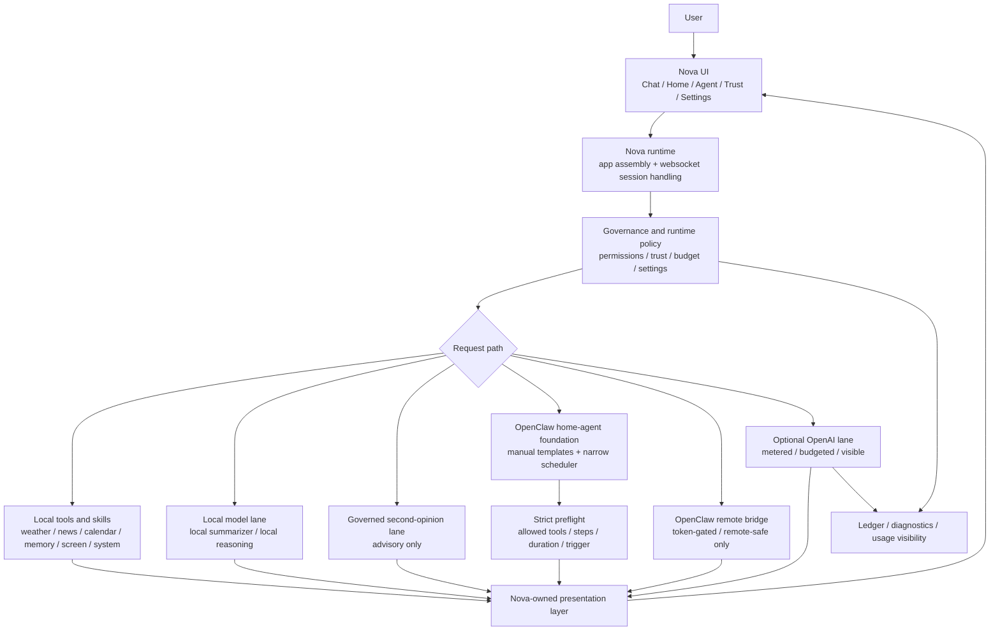
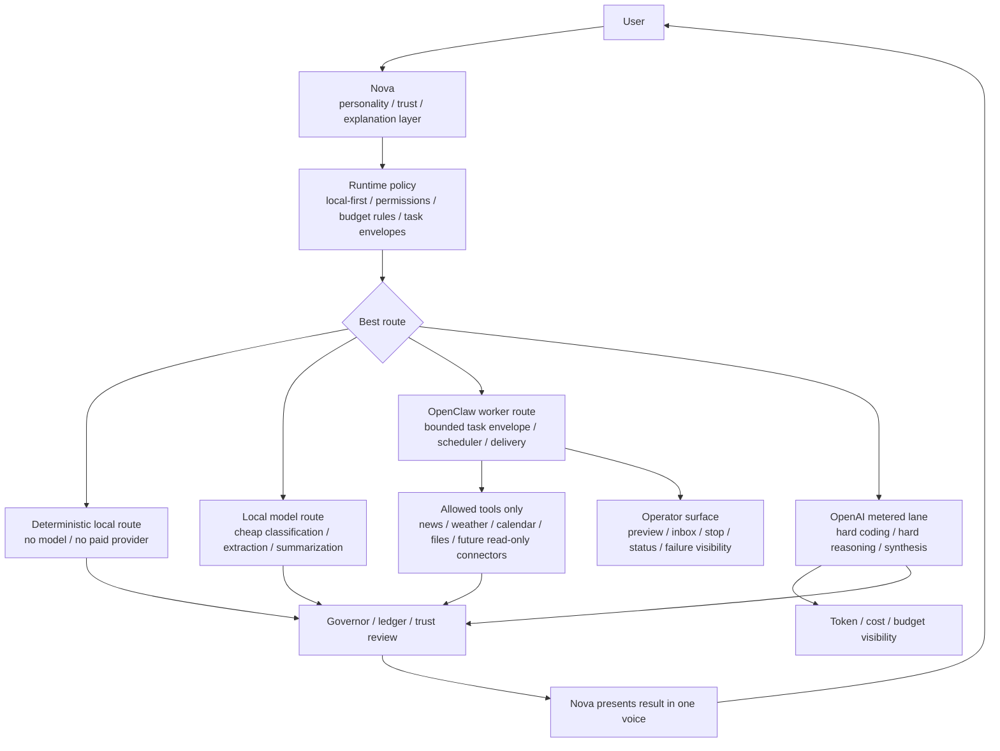

# Nova System Map - Current and Future
Updated: 2026-03-27
Status: Repo-grounded current map plus target end-to-end shape

## Purpose
This document saves the plain-language system map for Nova as it exists now and as it is intended to evolve next.

Use this when you want a single fast answer to:
- how Nova is wired today
- where OpenClaw fits
- where OpenAI fits
- what remains local-first
- what the future end-to-end target should look like

## The Plain-Language Model
Today:
- Nova is the assistant the user talks to
- OpenClaw is the worker layer inside Nova
- local tools and local models come first
- OpenAI is optional, metered, and visible

Target:
- Nova remains the personality and trust layer
- OpenClaw becomes the bounded worker/employee
- OpenAI becomes a governed high-power lane for hard coding and reasoning only
- trading stays research-first and paper-first before any live execution path

## Current System Diagram

## Current End-to-End Truth
For a normal local task:
1. the user asks Nova
2. Nova routes local-first
3. local skills or a local model answer
4. the result comes back through Nova's presentation layer
5. Trust and Settings can still show what route was used

For an OpenClaw run today:
1. the user opens the Agent page or a schedule becomes due
2. OpenClaw creates a small task envelope from a named template
3. strict preflight checks the request
4. structured data is gathered first
5. Nova tries the local summarizer first
6. if routing mode is `budgeted_fallback` and the local summarizer is unavailable, Nova may use the narrow metered OpenAI lane for one task-report pass
7. if no model path is available, Nova falls back to a deterministic summary
8. Nova presents the result in one voice
9. the run records delivery metadata and usage visibility

## Future System Diagram

## Future End-to-End Target
The intended build order is:
1. deterministic local tools first
2. local models second
3. OpenClaw for bounded worker tasks
4. OpenAI only for hard reasoning, coding, and synthesis

That target implies:
- no hidden cloud-first behavior
- no silent token burn
- no worker output bypassing Nova's voice
- no autonomous live trading without a separate risk engine and human approval path

## Trading Boundary
Trading should not start as live autonomous execution.

Safe target order:
1. research mode
2. watchlists and summaries
3. paper trading
4. human-approved live previews
5. only later, narrow live execution with hard limits

## Current Build Boundary
Live now:
- local-first Nova runtime
- optional metered OpenAI lane in Settings and Trust
- narrow OpenClaw task-report fallback into that lane
- usage visibility for OpenClaw runs that stay local or use metered tokens

Still deferred:
- broad agent execution authority
- wide connector ecosystem
- live trading execution
- full canonical Phase-8 automation spine

## Related Docs
- `docs/design/Phase 8/NOVA_OPENCLAW_HOME_AGENT_MASTER_REFERENCE_2026-03-27.md`
- `docs/design/Phase 8/OPENAI_AGENT_OPERATING_MODEL_2026-03-27.md`
- `docs/design/Phase 8/OPENAI_PROVIDER_ROUTING_AND_BUDGET_POLICY_2026-03-27.md`
- `docs/design/Phase 8/TRADING_MODE_GUARDRAILS_2026-03-27.md`
