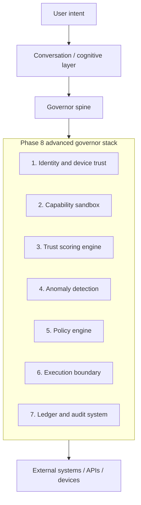
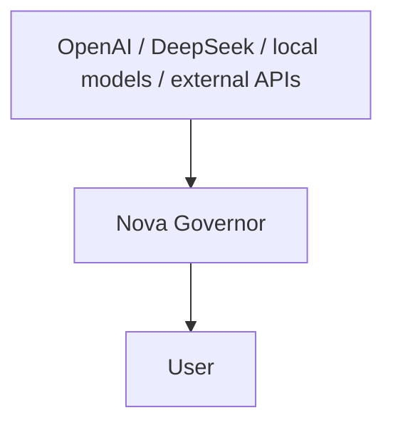

# Nova - Advanced Governor Layer Architecture (Phase 8)
Date: 2026-03-27
Status: Future design packet
Scope: Monitoring, trust enforcement, and external-system oversight

## 1. Purpose
This document defines the next evolution of Nova's Governor layer as a network-aware, trust-enforcing, anomaly-detecting control system.

The goal is:
- allow full user-intended capability
- while strictly monitoring, validating, and governing external interactions
- detecting unauthorized access, unsynced devices, malicious behavior, and abnormal patterns

Nova is not meant to restrict the operator.
Nova is meant to protect authority boundaries in real time.

## 2. Design Status Boundary
This is a design packet, not runtime proof.

It should be read this way:
- current runtime truth still lives in `docs/current_runtime/CURRENT_RUNTIME_STATE.md`
- current Phase-6 trust loop remains the live baseline
- current Phase-8 runtime remains the manual home-agent and narrow scheduling foundation
- this packet defines a stricter future Governor layer that should be phased in without overstating what is already live

## 3. Core Principle
> Allow everything intentional. Challenge everything unverified.

That preserves the intended product feel:
- no unnecessary friction for the trusted operator
- maximum scrutiny for unknown, unsafe, or unverified inputs

## 4. Governor Layer Evolution
From:
- capability gating
- execution boundary
- ledger logging

Toward:
- trust-aware execution
- device and source verification
- behavioral anomaly detection
- dynamic policy intelligence

## 5. System Architecture Overview

## 6. Key Systems
### 6.1 Identity and Device Trust Layer
Purpose:
- ensure every request comes from a verified, known, or explicitly approved source

Target features:
- device fingerprinting for local and network identity
- session-bound identity tokens
- trusted device registry
- unsynced device detection

Target behavior:
- known device: seamless execution
- unknown device: flagged and approval-required

Example:
`Incoming request -> device not recognized -> Nova asks for approval`

### 6.2 Capability Sandboxing
Purpose:
- prevent any external system from exceeding its allowed authority

Rules:
- every tool and API runs inside a bounded capability scope
- no cross-capability escalation
- no implicit chaining

Examples:
- web search cannot trigger file access
- file read cannot trigger system control
- external AI output cannot become execution authority

### 6.3 Trust Scoring Engine
Purpose:
- move beyond binary allow or deny into graded trust evaluation

Trust factors:
- device recognition
- credential validity
- behavioral consistency
- frequency patterns
- sensitivity of the request

Trust levels:
- high trust: seamless execution
- medium trust: soft confirmation
- low trust: hard block or stronger verification

### 6.4 Behavioral Anomaly Detection
Purpose:
- detect deviations from normal usage patterns

Signals:
- unusual activity hours
- command-frequency spikes
- new capability combinations
- unusual data-access patterns

Responses:
- anomaly tagging
- raised trust thresholds
- temporary restriction or extra confirmation

### 6.5 Dynamic Policy Engine
Purpose:
- let Nova enforce rules while staying user-sovereign

Policy families:
- device-based rules
- capability restrictions
- time-based limits
- network trust zones

Important boundary:
- policy suggestions can be proactive
- policy acceptance remains user-controlled

Nova may suggest:
> This pattern appears frequently. Would you like to allow it automatically?

### 6.6 Multi-Factor Execution Confirmation
Purpose:
- protect high-risk actions when trust is low or uncertainty is high

Trigger conditions:
- low trust score
- high-impact action
- unknown device
- anomaly detected

Potential methods:
- confirmation prompt
- secondary-device approval later
- time-delay execution

### 6.7 Immutable Ledger and Audit Upgrade
Purpose:
- keep full transparency and traceability

Must log:
- request
- trust score at execution time
- device identity
- policy applied
- anomaly tags
- final outcome

Phase-8 direction:
- behavioral pattern mapping
- normal-versus-anomaly tagging
- session reconstruction

## 7. Threat Model
Nova should detect:

### 7.1 Unsynced Devices
- new device attempting interaction
- unknown session tokens

### 7.2 Credential Abuse
- invalid tokens
- replay or reuse outside expected flow
- access outside the expected interaction path

### 7.3 Behavioral Attacks
- rapid-fire command bursts
- automation-like behavior that does not match operator norms
- capability sequences that diverge from expected patterns

### 7.4 Cross-System Intrusion Attempts
- one capability invoking another without policy
- unauthorized chaining across scopes

## 8. Zero-Trust Overlay
Recommended interpretation:
- nothing is trusted by default
- everything is verified at the boundary

This applies to:
- external APIs
- local tools when invoked through remote or delegated paths
- external AI systems
- future OpenClaw automation

## 9. Relationship to External AI
Nova should sit above all intelligence systems:

Rules:
- external AI provides intelligence, not authority
- Nova remains the authority control layer
- external systems cannot execute directly
- external systems cannot bypass the Governor
- external systems cannot escalate privileges

## 10. Correct Timing Across Phases
This packet spans more than one shipping step, so the timing needs to stay explicit.

### Phase 8 - strict execution foundations
Good fit here:
- trust-aware execution design
- device-trust registry scaffolding
- trust score fields in internal payloads
- enhanced ledger schema planning
- anomaly-tag design
- zero-trust rules for external AI and connector paths

### Phase 8.5 - operator-visible monitoring hardening
Good fit here:
- read-only anomaly surfacing
- trust-review visibility
- non-authoritative policy suggestions
- stronger operator-facing audit and review panels

### Phase 9 and later
Better deferred here:
- broad multi-factor action flows
- secondary-device approval
- wider connector trust zones
- cross-device orchestration
- more autonomous supervision under reviewable controls

## 11. Implementation Checklist
- [ ] Device trust registry
- [ ] Trust scoring engine
- [ ] Behavioral pattern tracking
- [ ] Anomaly detection system
- [ ] Dynamic policy suggestions (non-authoritative)
- [ ] Multi-factor execution paths
- [ ] Enhanced ledger with trust and anomaly tagging
- [ ] Zero-trust enforcement overlay

## 12. What This Unlocks
If implemented correctly, Nova becomes:
- a governed assistant
- a personal AI security layer
- a network authority firewall
- a behavior-aware system monitor
- a trust engine sitting over all intelligence and execution

## 13. Strategic Positioning
The value is not that Nova competes with large-model vendors on raw intelligence.

The value is that Nova adds:
- authority
- safety
- ownership
- control

They provide intelligence.
Nova provides the governing layer they do not.

## 14. Final Statement
This direction evolves Nova from:
- a governed AI system

Toward:
- a sovereign control layer over intelligence, devices, and execution

Important boundary:
- that statement is the design direction
- it must not be misread as proof that the full runtime is already there today
