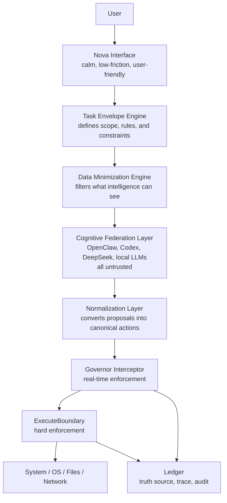

# Phase 8 OpenClaw Canonical Governed Automation Spec
Date: 2026-03-25
Status: Canonical Phase-8 source of truth for OpenClaw direction
Scope: Full governed automation and OpenClaw-style execution model under Nova governance
Derived from: `docs/design/Phase 8/openclaw.txt` (raw source note preserved)

## Authority Note
This document is now the formal canonical design truth for how OpenClaw should fit into Nova.

It replaces the older role of `PHASE_8_OPENCLAW_GOVERNED_EXECUTION_PLAN.md` as the primary OpenClaw direction document.
That earlier file remains useful as implementation context and phase sequencing support, but this document is the final architectural source of truth.

This is still a design document, not runtime truth.
Runtime truth remains in:
- `docs/current_runtime/CURRENT_RUNTIME_STATE.md`
- `docs/current_runtime/RUNTIME_FINGERPRINT.md`
- `docs/PROOFS/`

## Purpose
Nova needs a future execution model that can:
- grant near-full computer access for bounded automation tasks
- enable OpenClaw-style intelligence systems to perform real work
- support multi-step project execution while the user is away
- remain user-friendly and low-friction at the interface layer
- preserve strict governance, security, and system sovereignty
- prevent unauthorized access, data leakage, and rogue behavior

The core intent is not to make Nova autonomous.
The core intent is to let untrusted intelligence operate inside a governed execution environment.

## Core Principles
These are non-negotiable.

| Principle | Statement |
| --- | --- |
| Distrust | All intelligence is untrusted. |
| Control | All execution remains governed. |
| Boundary | Intelligence and authority stay separate. |
| Visibility | All meaningful actions are observable and auditable. |
| Intervention | The Governor can stop, pause, or deny mid-action. |
| Minimization | Only necessary data is exposed to intelligence. |

These rules apply equally to:
- OpenClaw
- Codex
- DeepSeek
- OpenAI APIs
- local models
- any future agent or model provider

## End-State Identity
Nova is not just an assistant.
Nova is not just an agent.

Nova is a governed execution environment that allows untrusted intelligence to operate safely within enforced boundaries.

Nova acts as:
- the control plane for tasks and execution flow
- the AI firewall that filters and enforces policy
- the execution authority boundary
- the data exposure filter
- the policy enforcement system
- the audit and trace system

## Canonical Architecture

## Architecture Rules
### Cognitive Federation Layer
This layer is untrusted.
Its job is to propose, not to execute.

That means:
- it may propose actions only
- it has no direct execution path
- it has no durable authority
- it does not gain persistent memory or permission by existing in the stack

### Normalization Layer
All free-form outputs from OpenClaw or any other intelligence provider must be normalized into canonical action shapes before enforcement.

That means:
- no raw model output is treated as authority
- no free-form plan can execute directly
- proposals become structured action attempts before policy evaluation

### Governor Interceptor
The Governor Interceptor is the only allowed path to real-world effect.

That means:
- it validates envelope scope and policy
- it checks anomaly signals in real time
- it allows, denies, pauses, or escalates each action attempt
- it remains in the loop for every step, not just the first one

### ExecuteBoundary
ExecuteBoundary is the hard enforcement layer.

That means:
- only approved actions execute
- disallowed actions fail closed
- anomalies can pause execution mid-stream
- there is no bypass around this boundary

### Ledger
The ledger is the truth source for all automation behavior.

That means:
- all action attempts are logged
- policy breaches are recorded
- envelope traces are preserved
- the user can later understand what happened and why

## Critical Gaps This Canonical Direction Closes
### 1. No mandatory interception layer
Old risk:
- execution could be reached too directly after user approval

Canonical fix:
- the Governor Interceptor is the sole path to ExecuteBoundary
- all real-world actions pass through interception first

### 2. No mid-execution control
Old risk:
- multi-step automation could continue once started without per-step re-evaluation

Canonical fix:
- every action attempt is evaluated individually
- anomaly detection and policy checks can pause or deny mid-stream

### 3. Data minimization was conceptual only
Old risk:
- models could see more than they should

Canonical fix:
- Data Minimization Engine runs before any intelligence call
- file scope, content slicing, and redaction become enforceable system behavior

### 4. Network mediation was not universally enforced
Old risk:
- external calls could happen outside one central approval layer

Canonical fix:
- NetworkMediator becomes the sole outbound network authority
- all network access is envelope-scoped and policy-checked

### 5. Anomaly detection lacked concrete definition
Old risk:
- there was no formal runtime mechanism for suspicious sequences

Canonical fix:
- anomaly detection begins simple but mandatory
- later phases extend it with sequence, chaining, drift, and intent-mismatch scoring

## Operational Invariants
These are hard rules, not suggestions.

1. Every execution must be associated with an active TaskEnvelope.
2. No execution path may exist outside the Governor Interceptor.
3. All actions are observed and logged.
4. The Governor can stop mid-action.
5. Data minimization is enforced before any intelligence call.
6. Network mediation is centralized.
7. Task envelopes are ephemeral.
8. A global kill switch must always exist.

## Final Hardening Rules
### Envelope requirement
If no active envelope exists, execution is denied.
There is no default global execution authority.

### Default deny
If an action cannot be confidently classified as allowed, it is denied or escalated.
Nothing is implicitly permitted.

### Network deny by default
Network access is off unless explicitly enabled in the envelope.

### Filesystem explicit-scope only
If no `allowed_paths` are declared, no filesystem access is allowed.

### Anomaly evolution
The initial anomaly detector is intentionally simple.
Later phases can extend it to cover:
- action sequence anomalies
- suspicious tool chaining
- task drift scoring
- mismatch between original user request and current action stream

## Canonical Component Set
The core component families required by this direction are:
- `TaskEnvelope`
- `ActionAttempt`
- `GovernorInterceptor`
- `AnomalyDetector`
- `DataMinimizationEngine`
- `NetworkMediator`
- `OpenClawAdapter`
- `ExecuteBoundary`
- `Ledger`

The exact implementation can evolve, but the architectural responsibilities above must remain.

## Governor Modes
| Mode | Behavior | Role in roadmap |
| --- | --- | --- |
| Strict | Every action requires approval; zero autonomy | earliest safe execution mode |
| Envelope | User approves the task envelope once; in-scope actions proceed automatically | bounded automation mode |
| Supervisory | Nova stays quiet while actions remain in-policy and only intervenes on breach, anomaly, or scope drift | long-term target |

The supervisory mode is the long-term OpenClaw target.
It should only exist after the interception, minimization, anomaly, and trace layers are proven.

## Implementation Order
### Phase 1: Enforcement foundation
- add `TaskEnvelope`, `ActionAttempt`, and `GovernorInterceptor`
- route all execution attempts through the interceptor
- enforce no-envelope denial
- add first anomaly detector
- wrap existing execution paths behind interception and mediation

### Phase 2: Data minimization
- implement `DataMinimizationEngine`
- integrate it before any intelligence call
- refactor file-context building to use it consistently

### Phase 3: Network control
- implement `NetworkMediator`
- refactor all external-calling skills to use it
- enforce envelope-based network rules

### Phase 4: OpenClaw integration
- implement `OpenClawAdapter` in proposal-only mode
- wire it into the Cognitive Federation Layer
- test only inside narrow envelopes first

### Phase 5: Supervisory automation
- extend anomaly detection
- add pause/resume behavior
- support bounded walk-away automation under envelope control

## Testing Requirements
Before moving deeper into Phase 8, Nova should prove these failure cases:
- action outside `allowed_paths` is denied
- access to sensitive files pauses or denies
- envelope action limits are enforced
- no active envelope means denial
- action-rate spikes pause execution
- network without explicit enablement is denied
- unauthorized domains are denied

## Risk and Mitigation
| Risk | Mitigation |
| --- | --- |
| Fast-path execution bypasses interception | treat bypass attempts as architectural violations and test for them explicitly |
| Envelope scope is too broad | require explicit allowed paths and fail closed when missing |
| Anomaly detector raises false positives | allow override paths only with traceability and iterative rule hardening |
| Per-step interception adds overhead | accept the overhead as a safety cost and optimize only after correctness |
| OpenClaw output looks convincing but is unsafe | treat all output as untrusted until normalized, validated, and policy-checked |

## What This Means For OpenClaw Specifically
OpenClaw should not be treated as a smart autonomous operator.
It should be treated as:
- an untrusted proposal generator
- a bounded structured executor only after approval and validation
- a component inside Nova's control plane, not above it

That means:
- OpenClaw does not decide policy
- OpenClaw does not own permissions
- OpenClaw does not gain persistent authority
- OpenClaw never becomes a side door around Nova's Governor

## Relationship To Existing Phase 8 Docs
This file is now the canonical OpenClaw truth.

Use the following support docs as secondary context:
- `docs/design/Phase 8/PHASE_8_OPENCLAW_GOVERNED_EXECUTION_PLAN.md`
- `docs/design/Phase 8/node design.txt`
- `docs/design/Phase 8/openclaw.txt`

Interpretation rule:
- this canonical spec defines what OpenClaw should be in Nova
- the earlier governed execution plan helps sequence implementation
- the raw note preserves the originating design language and hardening intent

## Final Identity Statement
Nova does not trust intelligence.
Nova governs it.

Nova's power does not come from what it can do.
It comes from what it refuses to allow without governance.
