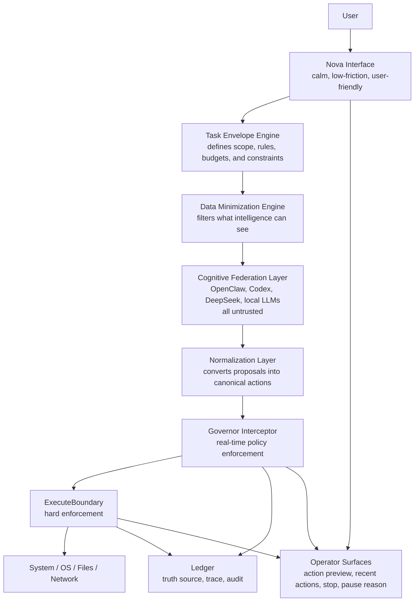

# Phase 8 OpenClaw Canonical Governed Automation Spec
Date: 2026-03-25
Status: Canonical Phase-8 source of truth for OpenClaw direction
Scope: Governed automation and OpenClaw-style execution under Nova governance
Derived from: `docs/design/Phase 8/openclaw.txt` (raw source note preserved)

## Authority Note
This document is the canonical design truth for how OpenClaw should fit into Nova.

It replaces the older role of `PHASE_8_OPENCLAW_GOVERNED_EXECUTION_PLAN.md` as the primary OpenClaw direction document.
That earlier file remains useful as implementation context and sequencing support, but this document is the final architectural source of truth.

This is still a design document, not runtime truth.
Runtime truth remains in:
- `docs/current_runtime/CURRENT_RUNTIME_STATE.md`
- `docs/current_runtime/RUNTIME_FINGERPRINT.md`
- `docs/PROOFS/`

## Product Definition
Nova is not just an assistant.
Nova is not just an agent.

Nova is a governed execution environment that allows untrusted intelligence to operate safely within enforced boundaries.

Nova acts as:
- the control plane for tasks and execution flow
- the AI firewall that filters and enforces policy
- the execution authority boundary
- the data exposure filter
- the audit and trace system
- the user-trust layer that explains what happened and why

## Product Goal
Nova needs a future execution model that can:
- grant broad but bounded computer access for approved automation tasks
- let OpenClaw-style intelligence systems perform useful work without gaining authority
- support multi-step project execution while the user is away only when the envelope permits it
- stay calm and low-friction in the interface
- preserve strict governance, security, and system sovereignty
- prevent unauthorized access, data leakage, and rogue behavior

The core intent is not to make Nova autonomous.
The core intent is to let untrusted intelligence operate inside a governed execution environment.

## Product Non-Goals
This design does not authorize:
- hidden autonomy
- silent background execution outside an approved envelope
- provider output becoming execution authority
- always-on listening or self-starting action loops
- implicit trust because a model is persuasive

## Core Principles
These are non-negotiable.

| Principle | Statement |
| --- | --- |
| Distrust | All intelligence is untrusted. |
| Control | All execution remains governed. |
| Boundary | Intelligence and authority stay separate. |
| Visibility | All meaningful actions are observable and auditable. |
| Intervention | The Governor can stop, pause, or deny mid-action. |
| Minimization | Only necessary data is exposed to intelligence. |

These rules apply equally to:
- OpenClaw
- Codex
- DeepSeek
- OpenAI APIs
- local models
- any future agent or model provider

## Canonical Architecture

## Canonical Component Responsibilities
| Component | Responsibility |
| --- | --- |
| Task Envelope Engine | Defines approved scope, resource budgets, time limits, and escalation conditions. |
| Data Minimization Engine | Builds the smallest safe context before any intelligence call. |
| Cognitive Federation Layer | Produces proposals only. Never executes. Never owns authority. |
| Normalization Layer | Converts free-form provider output into canonical action attempts. |
| Governor Interceptor | Evaluates every action attempt against policy, scope, budget, anomaly state, and user approval. |
| ExecuteBoundary | Enforces approved actions only and fails closed on disallowed execution. |
| NetworkMediator | The only outbound network authority. |
| Ledger | Records proposal, normalization, decision, execution, and result continuity. |
| Operator Surfaces | Keep the user informed with previews, status, stop controls, and failure reasons. |

## Hard Boundary Rules
### 1. Path authority must be canonical, not substring-based
Allowed filesystem scope must use normalized, resolved paths.

That means:
- compare real canonical paths, not string fragments
- reject path traversal escapes
- evaluate symlinks and junctions after resolution
- treat missing `allowed_paths` as deny-by-default
- record the resolved path that was actually evaluated

### 2. Network authority must be hostname-based and re-checked on redirect
`NetworkMediator` is the sole outbound network authority.

That means:
- policy keys are normalized hostnames, not raw `netloc` strings
- credentials in URLs are denied
- redirects must be re-authorized hop by hop
- domain approval and port policy must be explicit
- missing network enablement means deny-by-default

### 3. Envelope automation requires explicit resource budgets
Envelope approval is not just "allowed actions."
It also requires explicit budgets.

Minimum envelope budgets should include:
- max actions
- max files touched
- max bytes read
- max bytes written
- max network calls
- allowed hostnames
- max duration

Without those budgets, Nova may support Strict mode only.

### 4. Audit provenance must be end-to-end
The ledger is only a truth source if it can prove continuity from proposal to execution result.

Minimum provenance fields should include:
- envelope id and envelope revision
- proposal id or proposal hash
- normalized payload hash
- provider name and model identifier
- decision reason
- executor result id or result hash
- timestamps for proposal, decision, execution, and completion

### 5. Anomaly detection must be envelope-scoped
Anomaly detection should not be globally noisy.

That means:
- recent action windows are tracked per envelope or task run
- pause decisions identify the specific envelope and reason
- anomaly rules start simple but are explicit and reviewable
- false-positive handling must be traceable

### 6. Proposal output never becomes authority
Free-form provider output is advisory only.

That means:
- no raw model text executes directly
- no provider may invent permissions
- no provider may widen envelope scope
- normalization always happens before interception

### 7. Operator visibility is part of the product, not polish
OpenClaw-style execution should not ship as an invisible backend behavior.

Required user surfaces include:
- plain-language action preview before execution when approval is required
- live run card or status view while execution is active
- visible stop and pause controls
- recent actions history
- plain-language blocked/failure reason

## Operational Invariants
These are hard rules, not suggestions.

1. Every execution must be associated with an active TaskEnvelope.
2. No execution path may exist outside the Governor Interceptor.
3. All actions are observed and logged.
4. The Governor can stop mid-action.
5. Data minimization is enforced before any intelligence call.
6. Network mediation is centralized.
7. Task envelopes are ephemeral.
8. A global kill switch must always exist.

## Critical Gaps This Direction Closes
### 1. No mandatory interception layer
Canonical fix:
- the Governor Interceptor is the sole path to ExecuteBoundary
- all real-world actions pass through interception first

### 2. No mid-execution control
Canonical fix:
- every action attempt is evaluated individually
- anomaly detection and policy checks can pause or deny mid-stream

### 3. Data minimization was conceptual only
Canonical fix:
- Data Minimization Engine runs before any intelligence call
- file scope, content slicing, and redaction become enforceable system behavior

### 4. Network mediation was not universally enforced
Canonical fix:
- NetworkMediator becomes the sole outbound network authority
- all network access is policy-checked and envelope-scoped

### 5. Audit continuity was too weak
Canonical fix:
- ledger requirements now include proposal-to-execution continuity
- the user can later see what was proposed, what was approved, and what actually ran

### 6. Envelope automation could become too broad too early
Canonical fix:
- Strict mode ships first
- Envelope mode requires explicit budgets and tighter proof
- Supervisory mode is later still

## Shipping Posture By Phase
### Phase 8: Safe first ship
Phase 8 should ship only the foundations for governed external execution.

Phase-8-safe scope:
- Strict mode only
- TaskEnvelope v1
- normalization layer
- Governor Interceptor
- ExecuteBoundary hardening
- Data Minimization Engine
- NetworkMediator
- proposal-only OpenClaw adapter
- operator surfaces such as action preview, recent actions, status, stop, and failure visibility

Phase 8 should not claim:
- quiet walk-away automation by default
- broad Envelope mode without explicit budgets
- silent supervisory execution

### Phase 9: Bounded envelope automation
Phase 9 is the first safe home for richer envelope automation.

Phase-9-appropriate scope:
- Envelope mode with explicit resource budgets
- per-envelope anomaly isolation
- pause/resume for bounded task runs
- shared execution visibility across Nova surfaces
- stronger operator controls for active runs

This is still governed automation, not autonomy.

### Phase 10 and later: Supervisory quietness only under reviewable control
Supervisory mode belongs only after:
- replayable eval coverage
- strong audit provenance
- proven anomaly quality
- explicit revocation and kill-switch reliability
- reviewable rule evolution

Supervisory quietness must never mean invisible authority growth.

## Testing Requirements
Before moving deeper into Phase 8, Nova should prove these failure cases:
- action outside resolved `allowed_paths` is denied
- symlink or junction escape is denied
- access to sensitive files pauses or denies
- envelope action limits are enforced
- envelope byte and file-count budgets are enforced before Envelope mode ships
- no active envelope means denial
- action-rate spikes pause the specific envelope under review
- network without explicit enablement is denied
- redirects to unauthorized domains are denied
- URLs with embedded credentials are denied
- unauthorized domains are denied
- proposal hash and executed payload hash are both captured in the ledger

## Risk And Mitigation
| Risk | Mitigation |
| --- | --- |
| Fast-path execution bypasses interception | treat bypass attempts as architectural violations and test for them explicitly |
| Path policy is fooled by string matching | require resolved-path checks and block traversal, symlink, and junction escape |
| Envelope scope is too broad | require explicit budgets and fail closed when missing |
| Network policy is bypassed by redirects or URL tricks | re-authorize each hop and normalize hostname policy keys |
| Anomaly detector raises false positives | keep rules envelope-scoped, reviewable, and overrideable with traceability |
| OpenClaw output looks convincing but is unsafe | treat all output as untrusted until normalized, validated, and policy-checked |
| Product UX becomes opaque under automation | require operator surfaces as part of the shipping contract |

## What This Means For OpenClaw Specifically
OpenClaw should not be treated as a smart autonomous operator.
It should be treated as:
- an untrusted proposal generator
- a bounded structured executor only after approval and validation
- a component inside Nova's control plane, not above it

That means:
- OpenClaw does not decide policy
- OpenClaw does not own permissions
- OpenClaw does not gain persistent authority
- OpenClaw never becomes a side door around Nova's Governor

## Relationship To Existing Phase 8 Docs
This file is the canonical OpenClaw truth.

Use the following support docs as secondary context:
- `docs/design/Phase 8/PHASE_8_OPENCLAW_GOVERNED_EXECUTION_PLAN.md`
- `docs/design/Phase 8/node design.txt`
- `docs/design/Phase 8/openclaw.txt`

Interpretation rule:
- this canonical spec defines what OpenClaw should be in Nova
- the earlier governed execution plan helps sequence implementation
- the raw notes preserve the originating design language and hardening intent

## Final Identity Statement
Nova does not trust intelligence.
Nova governs it.

Nova's power does not come from what it can do.
It comes from what it refuses to allow without governance.

Document Version: 3.1
Next Steps: Build Phase 8 as strict governed execution first, then mature envelope automation only in later phases.
Canonical Location: `docs/design/Phase 8/PHASE_8_OPENCLAW_CANONICAL_GOVERNED_AUTOMATION_SPEC_2026-03-25.md`