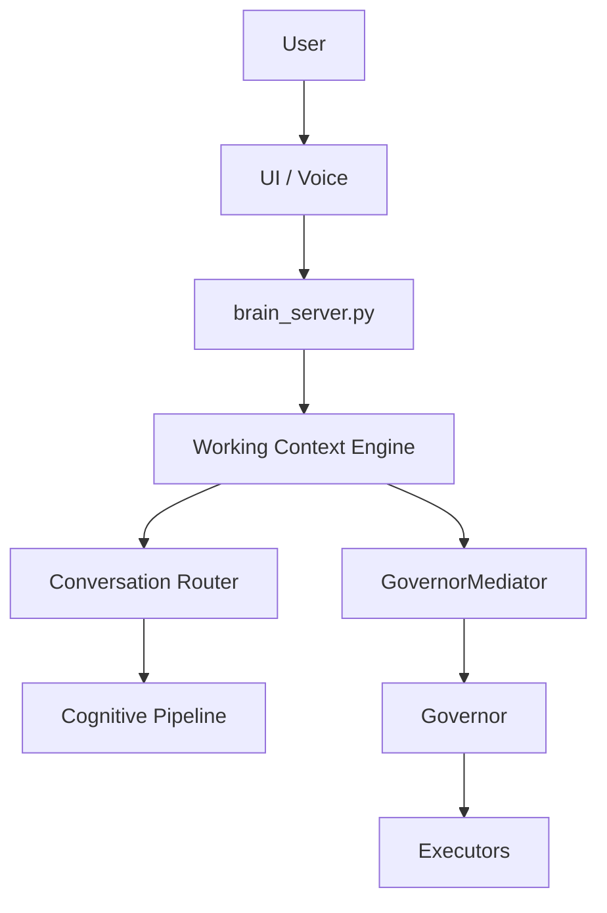

# NOVA Working Context Engine

Status: Design Draft (Phase-4.5 compatible, Phase-5 strengthening layer)  
Authority Expansion: None  
Persistence: Session-scoped only  
Governor Supremacy: Maintained

## Purpose

The Working Context Engine gives Nova a bounded model of the current task so responses are grounded in situation, not only the last sentence.

It improves follow-up understanding (for example, resolving "this" and "it") while preserving core governance constraints:
- no background autonomy
- no hidden persistence
- no execution authority

## Core Constraints

The engine may:
- maintain session-local task context
- aggregate explicit turn and invocation-time signals
- route context to analysis/presentation flows

The engine may not:
- persist user memory across sessions
- run hidden collection loops
- initiate actions
- bypass `brain_server -> GovernorMediator -> Governor`

## Placement

## V1 Schema

- `task_type`
- `task_goal`
- `active_app`
- `active_window`
- `active_url`
- `selected_file`
- `selected_text`
- `cursor_target`
- `current_step`
- `last_relevant_object`
- `recent_relevant_turns`
- `open_report_id`
- `system_context`
- `confidence_notes`

## Runtime Module Map

`nova_backend/src/working_context/`
- `context_state.py`
- `context_builder.py`
- `context_router.py`
- `context_pruner.py`
- `context_store.py`
- `context_signals.py`

## Current Integration

- Session store created per websocket session in `brain_server.py`.
- Context updated from:
  - explicit user turns
  - invocation-time context snapshots
  - executor-provided context deltas
- `Explain Anything` consumes context slice when routing ambiguous references.

## Ledger Events

- `WORKING_CONTEXT_CREATED`
- `WORKING_CONTEXT_UPDATED`
- `WORKING_CONTEXT_PRUNED`
- `WORKING_CONTEXT_CONSUMED`

## Definition of Done (V1)

- Session-local context exists and updates deterministically.
- No persistent writes from working-context modules.
- No hidden scheduling/threading/task loops.
- Explain mode uses working-context signals for better target resolution.
- Governance tests validate non-persistence and invocation-bound behavior.
