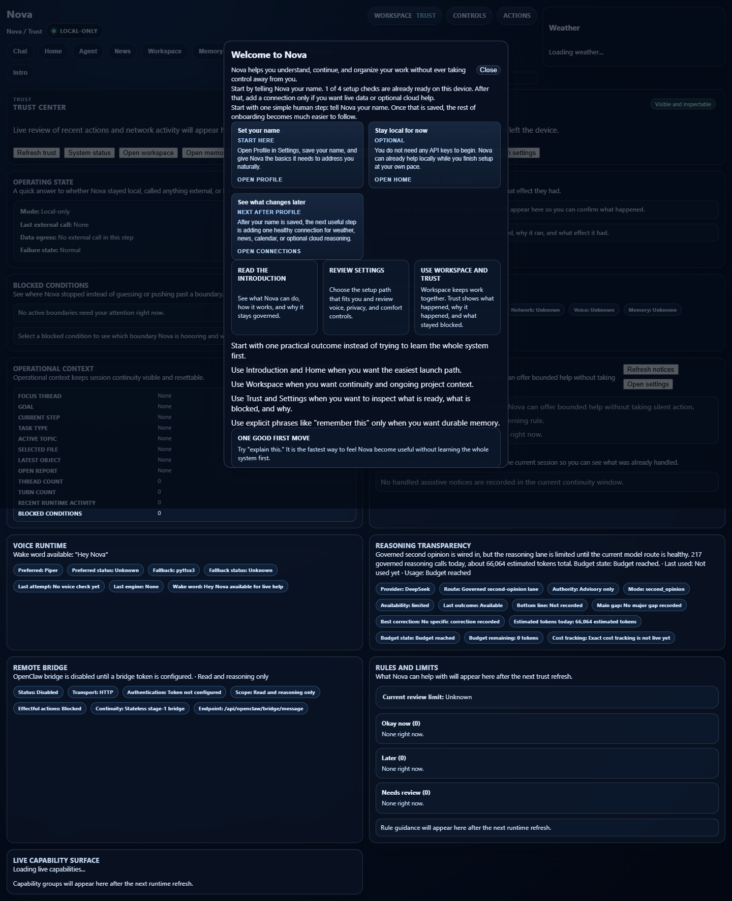

# NovaLIS Visual Proof

These screenshots show current local UI surfaces captured from a running NovaLIS development instance.

Exact runtime behavior can change as capabilities are enabled, disabled, or reconfigured. For current runtime truth, use [../current_runtime/CURRENT_RUNTIME_STATE.md](../current_runtime/CURRENT_RUNTIME_STATE.md).

---

## Dashboard Home

The home/dashboard surface emphasizes current setup, launch actions, workspace continuity, capability visibility, and local-first operation.

---

## Trust And Governance

The trust surface exposes recent action state, policy posture, and governance status so the user can inspect what Nova is doing instead of treating actions as hidden automation.

---

## Structured Report Output

The report view demonstrates how Nova presents structured findings, source notes, confidence context, and route/model badges in the chat surface.

