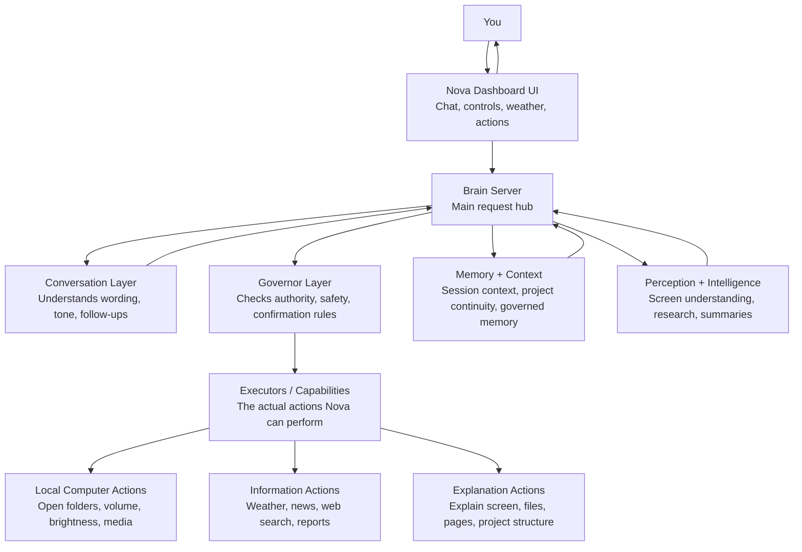
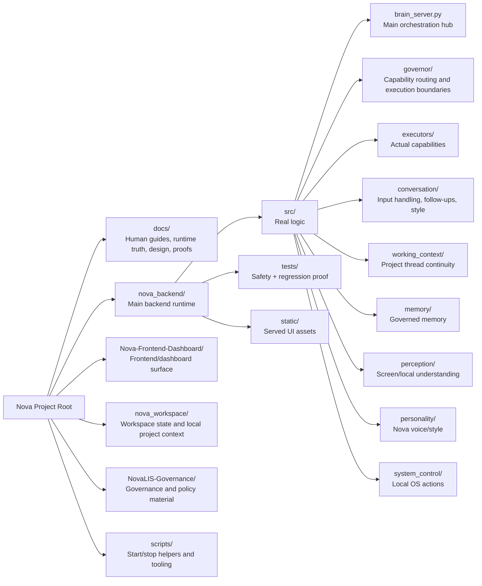

# Visual Architecture Map
Updated: 2026-03-21

## Purpose
This guide gives a simple visual map of Nova's codebase.

It is meant for people who want an easy way to understand:
- what the main parts of Nova are
- how the pieces fit together
- where the important code lives
- what the repository is trying to do as a whole

This is an explanatory guide, not runtime truth.
If this guide ever conflicts with live runtime behavior, the runtime truth docs win.

## The Easiest Way To Think About Nova
Nova is one workspace system with five main layers:

1. UI
2. Brain
3. Governor
4. Capabilities
5. Memory and context

## Simple System Diagram

## What Each Layer Means

### UI
The UI is the part you see and interact with.
It includes the dashboard, chat area, controls, actions, weather, and other visible surfaces.

### Brain
The brain is the main orchestration layer.
It receives requests, decides what kind of request they are, and routes them to the right part of the system.

### Governor
The governor is the execution boundary.
It checks whether Nova is allowed to do something, whether confirmation is needed, and which capability should handle the request.

### Capabilities
Capabilities are the actual things Nova can do.
These include local actions, search and reporting paths, explanation paths, and system-control helpers.

### Memory And Context
This layer helps Nova stay coherent.
It includes session conversation context, governed memory, and project continuity surfaces.

## Repository Diagram

## Plain-English Repo Meaning

### `docs/`
The documentation system.
This includes human guides, runtime truth docs, design packets, proof packets, and governance material.

### `nova_backend/`
The live backend runtime.
This is where Nova's main logic, governor path, executors, conversation system, memory, and tests live.

### `Nova-Frontend-Dashboard/`
A mirrored frontend/dashboard surface used to keep the interface aligned.

### `nova_workspace/`
Workspace state and local project context.

### `NovaLIS-Governance/`
Governance and policy materials connected to Nova's design posture.

### `scripts/`
Helper scripts for starting, stopping, checking, and maintaining the project.

## The Most Important Backend Parts

### `brain_server.py`
The main request hub.
If you want to understand how Nova decides what to do, start here.

### `governor/`
The safety and authority boundary.
This is where governed execution logic and capability routing live.

### `executors/`
The concrete task implementations.
These are the workers that actually carry out allowed capabilities.

### `conversation/`
The wording and response layer.
This is where input handling, follow-up logic, style shaping, and session routing live.

### `working_context/`
The project continuity layer.
This helps Nova stay aligned with the current thread of work.

### `memory/`
Governed memory storage and retrieval.

### `perception/`
Screen and local understanding helpers.

### `personality/`
Nova's style and presentation layer.

### `system_control/`
The local OS-control helpers used by allowed system actions.

## What Nova Is Trying To Be
Nova is not organized like a simple chatbot.

It is organized like a governed workspace system with separate layers for:
- execution authority
- cognitive analysis
- perception and explanation
- continuity and memory
- user experience

That separation is one of the most important ideas in the whole project.

## Fastest Understanding Path
If you want the shortest useful tour of Nova, use this order:

1. `README.md`
2. `REPO_MAP.md`
3. `docs/reference/HUMAN_GUIDES/README.md`
4. `docs/reference/HUMAN_GUIDES/12_CODEBASE_TOUR.md`
5. `docs/current_runtime/CURRENT_RUNTIME_STATE.md`
6. `nova_backend/src/brain_server.py`
7. `nova_backend/src/governor/`
8. `nova_backend/src/executors/`

## One-Sentence Summary
Nova is a governed workspace assistant:
the UI talks to the brain, the brain routes through the governor, the governor controls capabilities, and memory plus context keep the whole system coherent.
