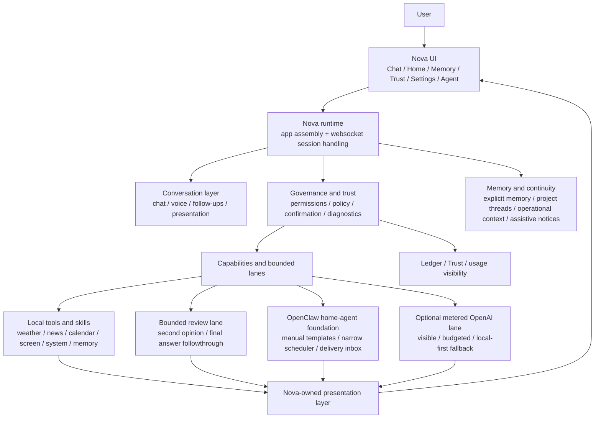
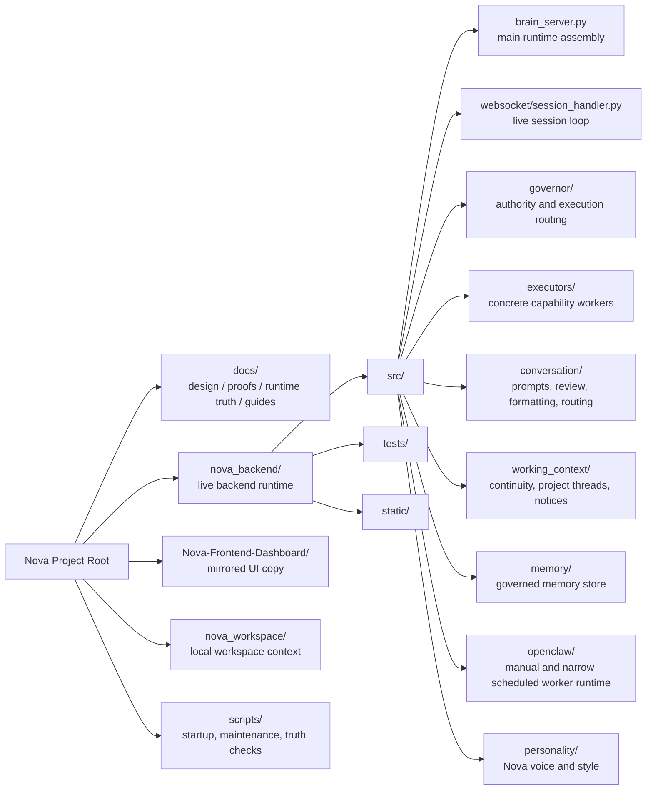

# Visual Architecture Map
Updated: 2026-03-28

## Purpose
This guide explains Nova's architecture in normal human language.

Use it when you want a grounded answer to:
- what the main parts of Nova are
- how the pieces fit together today
- where OpenClaw fits
- where optional OpenAI routing fits
- what is current versus future

This is an explanatory guide, not runtime law.
If this guide ever conflicts with live runtime behavior, the runtime truth docs win.

## The Easiest Way To Think About Nova
Nova is one system with five main layers:

1. UI and experience
2. Conversation and presentation
3. Governance and trust
4. Capabilities, reasoning, and agent lanes
5. Memory and continuity

## Current System Diagram

## What Each Layer Means

### 1. UI and experience
This is the part users actually see.
It includes:
- dashboard pages
- chat surfaces
- widgets
- voice interactions
- Agent, Trust, Memory, and Settings pages

### 2. Conversation and presentation
This is how Nova turns requests into understandable responses.
It includes:
- input normalization
- follow-up handling
- response shaping
- voice-friendly summaries
- same-session answer refinement

### 3. Governance and trust
This is Nova's authority boundary.
It includes:
- governor routing
- execution rules
- capability control
- review and policy surfaces
- runtime diagnostics
- user-visible trust state

### 4. Capabilities, reasoning, and agent lanes
This is the working layer.
It includes:
- local skills and executors
- bounded second-opinion reasoning
- OpenClaw worker flows
- optional metered cloud fallback where allowed

Important truth:
- not every smart path is an execution path
- advisory reasoning is not execution authority
- agent help is still bounded and policy-shaped

### 5. Memory and continuity
This is how Nova stays coherent over time.
It includes:
- explicit personal memory
- thread continuity
- operational remembrance
- bounded assistive noticing

## Repository Diagram

## Current Big-Picture Truth
If you explain Nova to a technical person today, the cleanest summary is:
- Nova is the assistant and trust layer
- local tools and local models come first
- the review lane is bounded and advisory only
- OpenClaw is a worker layer inside Nova, not a separate authority center
- optional metered OpenAI use is visible and policy-shaped, not the default brain for everything

## Future Direction
The intended future shape is:
- stronger cross-system continuity
- wider but still governed connectors
- broader agent execution only after stricter Phase 8 execution components land
- local-first routing staying the default even as higher-power lanes grow

## Read With
For the user explanation:
- `01_START_HERE.md`
- `02_HOW_NOVA_WORKS.md`
- `07_CURRENT_STATE.md`

For the system explanation:
- `docs/design/Phase 8/NOVA_SYSTEM_MAP_CURRENT_AND_FUTURE_2026-03-27.md`
- `28_OPENCLAW_SETUP_AND_RUNTIME_GUIDE_2026-03-27.md`
- `docs/current_runtime/CURRENT_RUNTIME_STATE.md`

## One-Sentence Summary
Nova is a local-first governed AI workspace where conversation, memory, trust, reasoning, and agent help all connect through one visible authority boundary.
