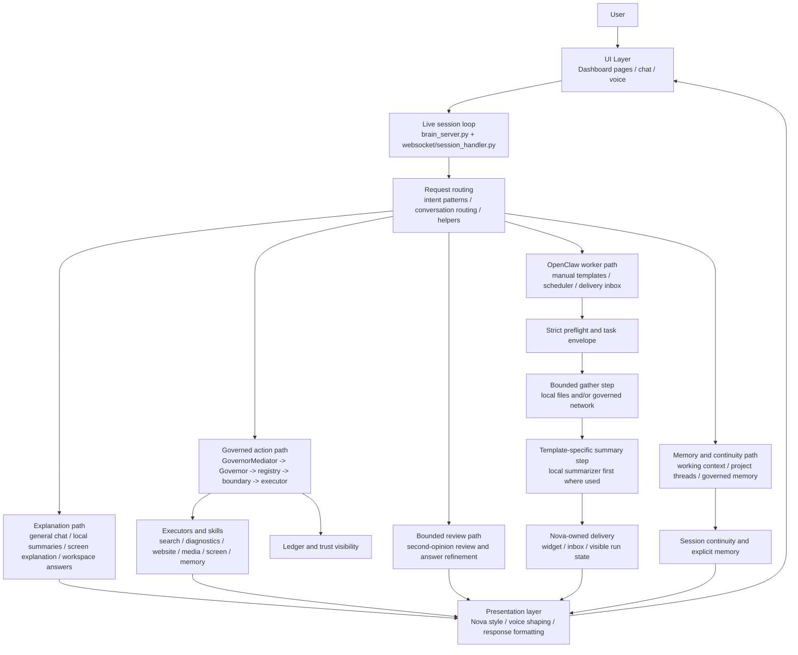
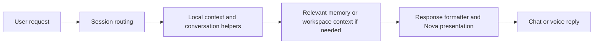
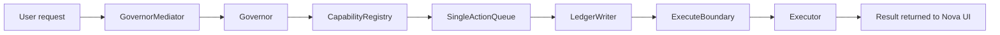
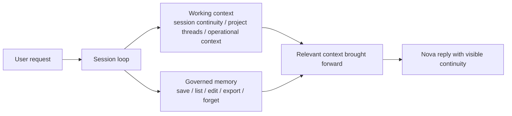
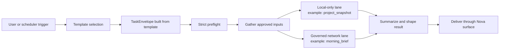
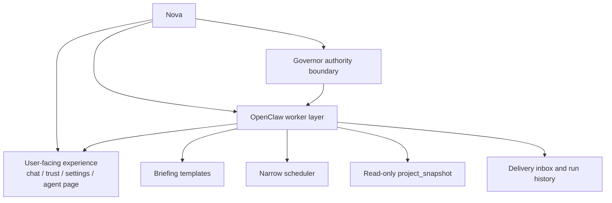
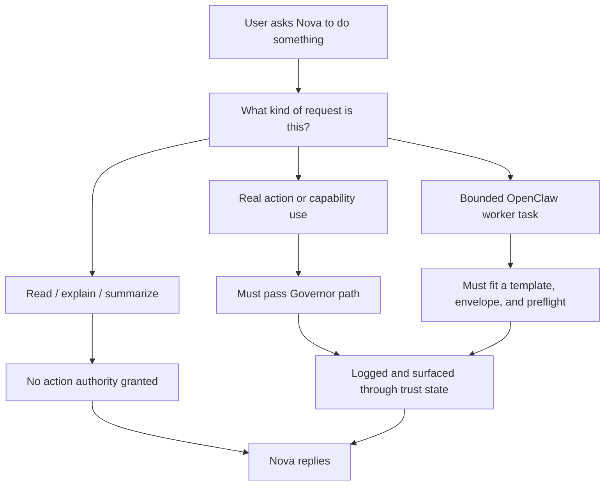

# Nova System Process And Explainability Guide
Updated: 2026-04-13

## Purpose
This guide explains how Nova actually works from start to finish in plain language.

It is for people who want to understand:
- what happens when you talk to Nova
- where decisions are made
- where safety checks happen
- where memory fits
- where OpenClaw fits
- why Nova can be smart without silently becoming fully autonomous

This is an explanatory human guide.
If this guide ever conflicts with runtime truth, use:
- `docs/current_runtime/CURRENT_RUNTIME_STATE.md`
- `docs/current_runtime/RUNTIME_CAPABILITY_REFERENCE.md`

## The Short Honest Version
Nova is a local-first governed assistant workspace.

That means:
- the user talks to Nova through the dashboard or voice
- Nova routes the request through the live backend session loop
- explanation paths stay separate from action paths
- real actions must pass the Governor path
- memory is explicit and inspectable
- OpenClaw is a bounded worker layer inside Nova, not a hidden authority center

## The Main Idea
The easiest way to understand Nova is:

1. the user asks for something
2. Nova figures out what kind of request it is
3. Nova chooses the right path
4. if action is needed, Governor rules apply
5. Nova returns the result in Nova's voice
6. trust, memory, and history stay visible instead of hidden

## End-To-End System Diagram

## What Each Box Means

### 1. UI layer
This is what the user sees.

Main runtime surface:
- `nova_backend/static/`

Main entry file:
- `nova_backend/static/index.html`

This layer includes:
- Home
- Chat
- News
- Workspace
- Trust
- Memory
- Settings
- Agent

The UI does not decide authority by itself.
It sends requests into the backend runtime.

### 2. Live session loop
This is where the running app receives the user's request and starts the real logic.

Main files:
- `nova_backend/src/brain_server.py`
- `nova_backend/src/websocket/session_handler.py`

This layer:
- opens the app
- wires the routers
- starts the websocket session
- holds the active session state
- sends widgets and messages back to the frontend

If you want the truest "where does Nova begin?" answer in code, start here.

### 3. Request routing
This is where Nova decides what kind of thing the user asked for.

Main file:
- `nova_backend/src/websocket/session_handler.py`

Main helpers and patterns come from:
- `nova_backend/src/websocket/intent_patterns.py`
- `nova_backend/src/conversation/`

This layer separates requests into broad families such as:
- local explanation
- governed capability use
- memory commands
- workspace/project continuity
- second-opinion review
- OpenClaw operator tasks

This is one of Nova's most important design strengths:
the system does not treat every request as the same kind of request.

## The Four Core Runtime Paths

### Path A: Explanation path
This is the read-first, explain-first path.

Examples:
- "explain this"
- "what am I looking at"
- "help me understand this project"
- ordinary chat

Typical flow:

This path is about understanding and response quality.
It is not supposed to quietly become an action path.

### Path B: Governed action path
This is the path for real capability use.

Examples:
- open a website
- adjust brightness
- capture the screen
- save memory

Current authority spine from runtime truth:

`User -> GovernorMediator -> Governor -> CapabilityRegistry -> SingleActionQueue -> LedgerWriter -> ExecuteBoundary -> Executor`

Diagram:

What this means in plain terms:
- Nova does not directly jump from a thought to an action
- enabled capability rules matter
- confirmation and trust logic matter
- actions are logged
- execution happens in a controlled worker, not in the chat layer itself

### Path C: Memory and continuity path
This is how Nova stays coherent across a session and across explicit saved memory.

Main code areas:
- `nova_backend/src/working_context/`
- `nova_backend/src/memory/`

Diagram:

Important truth:
- session continuity is not the same thing as durable memory
- durable memory is supposed to be explicit and inspectable
- Nova is designed to remember in bounded ways, not by hidden passive accumulation

### Path D: OpenClaw worker path
This is where Nova uses bounded worker-style help.

Main code areas:
- `nova_backend/src/openclaw/`
- `nova_backend/src/api/openclaw_agent_api.py`

Diagram:

What makes this different from broad unsafe agent systems:
- OpenClaw is not a free-running hidden agent
- templates define the task lane
- the envelope defines scope and budget
- preflight can block the run
- delivery is visible
- Nova remains the user-facing presenter

### Current OpenClaw templates
The current default template set is small on purpose.

Live now:
- `morning_brief`
- `evening_digest`
- `market_watch`
- `project_snapshot`

Present but not fully connected yet:
- `inbox_check`

The explainability value here is simple:
- you can name the template that ran
- you can describe what inputs it was allowed to use
- you can describe whether it stayed local or used governed network reads
- you can describe how the result came back to the user

## Where OpenClaw Fits Inside Nova
OpenClaw is part of Nova's worker layer, not a separate boss.

Today it mainly powers:
- manual briefing templates
- narrow scheduled briefing behavior
- delivery inbox flows
- active-run visibility
- early project-analysis work through read-only `project_snapshot`

Diagram:

The important explainability point is:
OpenClaw helps Nova do bounded task work, but it does not replace Nova's trust model.

## Where Models Fit
Nova is not just "one model talks to the user."
It is a routed system.

Current practical posture:
- deterministic local tools first
- local models next
- bounded worker lanes after that
- narrow metered cloud fallback only where explicitly allowed

That is why Nova can be more capable without becoming cloud-first by accident.

Important current nuance:
- not every OpenClaw template uses the exact same summary route
- some runs can stay fully local
- some runs can use governed network reads
- the narrow metered OpenAI lane is optional and only used in limited fallback situations

## Trust And Safety Diagram

This is the heart of Nova's design:

`Intelligence may expand. Authority may not expand silently.`

## What Does Not Happen
For explainability, it also helps to say what Nova is not doing.

Nova is not supposed to:
- let chat text directly bypass the Governor into execution
- turn every smart answer into an action attempt
- let OpenClaw run as a hidden broad-autonomy agent
- silently save long-term memory from everything you say
- use cloud reasoning as the automatic default for all work
- hide whether a result came from normal chat, a governed capability, memory context, or an OpenClaw template

## The Most Important Real Files
If someone wants to trace the real process in code, this is the best order:

1. `nova_backend/src/brain_server.py`
2. `nova_backend/src/websocket/session_handler.py`
3. `nova_backend/src/governor/governor_mediator.py`
4. `nova_backend/src/governor/`
5. `nova_backend/src/executors/`
6. `nova_backend/src/working_context/`
7. `nova_backend/src/memory/`
8. `nova_backend/src/openclaw/`
9. `docs/current_runtime/CURRENT_RUNTIME_STATE.md`

## What Nova Is Right Now
The truest simple description today is:

Nova is a governed local-first AI workspace with:
- a real backend session loop
- a strict action-governance path
- explicit memory and continuity systems
- a bounded second-opinion lane
- a bounded OpenClaw worker layer
- a live dashboard and voice surface

It is not yet:
- a broad autonomous agent
- a hidden background operator
- an unrestricted code mutation system

## Explainability Promise
If Nova is behaving correctly, a human should be able to answer:
- what path just ran
- whether an action happened
- what system allowed it
- what system blocked it
- where memory came from
- whether OpenClaw was involved

That explainability is not a side feature.
It is part of the product.

## Read With
- `docs/reference/HUMAN_GUIDES/02_HOW_NOVA_WORKS.md`
- `docs/reference/HUMAN_GUIDES/21_VISUAL_ARCHITECTURE_MAP.md`
- `docs/reference/HUMAN_GUIDES/28_OPENCLAW_SETUP_AND_RUNTIME_GUIDE_2026-03-27.md`
- `docs/current_runtime/CURRENT_RUNTIME_STATE.md`

## One-Sentence Summary
Nova works by routing each request into the right lane, keeping explanation separate from action, keeping action behind Governor controls, and keeping OpenClaw inside a visible bounded worker role.
